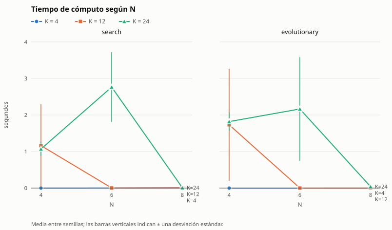
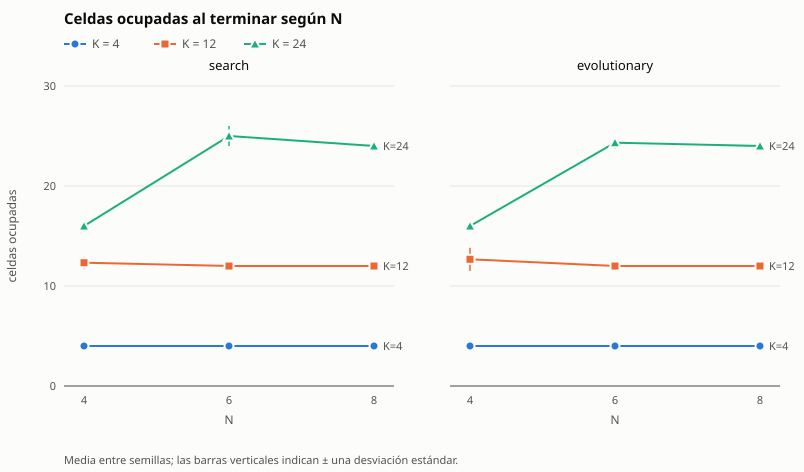
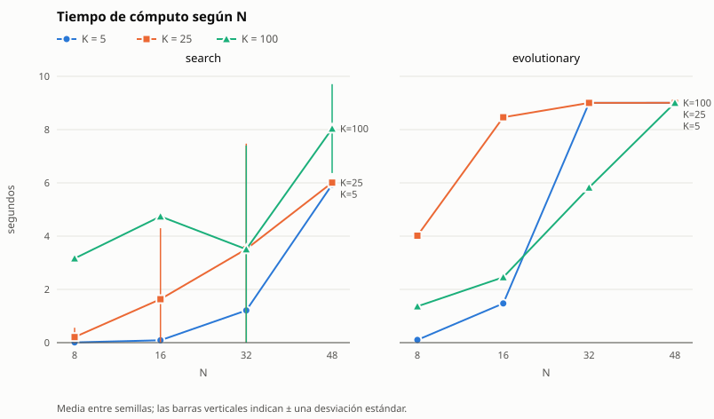
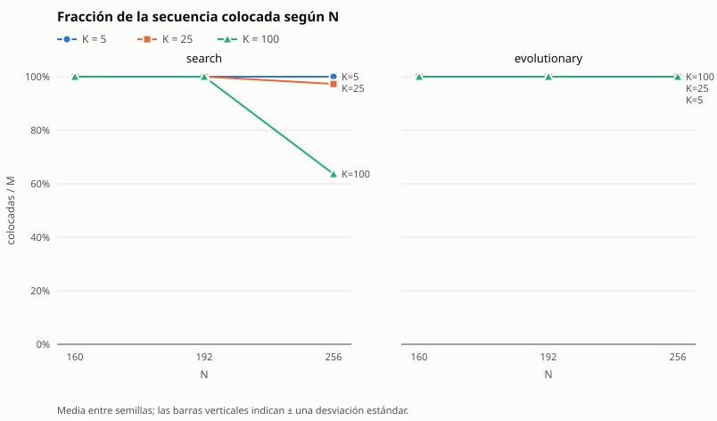
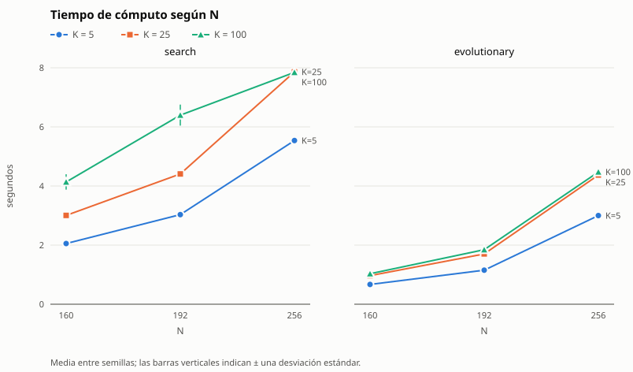

# Informe de TileUp — Tarea Corta 1

IC-6200 Inteligencia Artificial

**Integrantes:** María Félix Méndez Abarca, Cristhian Rivas y Jozafath Pérez

## Resumen

En este proyecto desarrollamos una solución para el juego TileUp utilizando dos
enfoques diferentes de Inteligencia Artificial: un agente de búsqueda y un agente
evolutivo. Además, implementamos el motor del juego, un validador independiente y
las herramientas necesarias para generar instancias y realizar las pruebas.

Primero desarrollamos el motor respetando las reglas indicadas en el enunciado. A
partir de este motor trabajamos los dos agentes por separado. Para el agente de
búsqueda utilizamos búsqueda en haz (*beam search*), mientras que para el agente
evolutivo utilizamos un algoritmo genético.

Durante el desarrollo realizamos diferentes pruebas para ajustar los parámetros y
mejorar el desempeño de los agentes. También comparamos ambos métodos utilizando
diferentes tamaños de tablero, cantidades de colores y semillas. Finalmente
realizamos pruebas de escalabilidad para observar qué sucede cuando aumenta el
tamaño del problema.

Los resultados mostraron que los dos agentes tienen un buen desempeño en las
instancias pequeñas y medianas. En problemas más grandes empiezan a aparecer
diferencias: la búsqueda generalmente encuentra soluciones con menos celdas
ocupadas, mientras que el evolutivo logra completar algunas instancias grandes en
las que la búsqueda alcanza el límite de tiempo.

## Motor y validador

Para representar el tablero utilizamos una tupla de tamaño N². Cada posición
puede estar vacía o contener una ficha con su color y valor. Elegimos esta
representación porque permite trabajar con los estados del juego sin modificar
los anteriores mientras los agentes exploran diferentes posibilidades.

Cuando se coloca una ficha, el motor revisa las posiciones de arriba, abajo,
izquierda y derecha. Si encuentra fichas del mismo color conectadas con la nueva
ficha, toma todo el grupo conectado, lo retira y deja en la celda donde se jugó
una sola ficha con la suma de los valores. Si no existe ninguna ficha del mismo
color conectada, simplemente se mantiene la ficha colocada. Como el grupo ya
incluye todas las fichas conectadas de ese color, la fusión nunca provoca otra.

La partida se gana al colocar las M fichas, aunque la última llene el tablero, y
se pierde si quedan fichas pendientes y no hay celdas vacías.

Durante el desarrollo también hicimos algunos cambios para evitar recorrer o
copiar el tablero más veces de las necesarias. Esto fue especialmente importante
cuando empezamos a probar tableros grandes, ya que las primeras versiones tardaban
mucho más en reproducir una partida.

Además del motor implementamos un validador independiente. Este no utiliza el
código del motor, sino que vuelve a comprobar las reglas por su cuenta. Revisa que
las posiciones estén dentro del tablero, que no se coloque sobre una celda
ocupada, que las fichas aparezcan en el orden correcto y que las métricas finales
coincidan con la partida realizada. De esta manera podemos verificar que las
soluciones generadas por los agentes sean legales.

## Agente de búsqueda

Para el primer agente utilizamos una búsqueda en haz. Elegimos este método porque
explorar todos los estados posibles sería demasiado costoso. La cantidad de
movimientos posibles depende de las celdas vacías y la secuencia puede ser
bastante larga, por lo que una búsqueda completa aumenta rápidamente de tamaño.

En cada paso el haz conserva solo los W mejores estados. Empezamos con un haz de
ancho 1 y lo vamos duplicando (2, 4, 8, …) mientras quede presupuesto, guardando
siempre la mejor solución encontrada.

### Estado

El estado está formado por:

- el tablero actual;
- la posición de la siguiente ficha de la secuencia.

El estado inicial corresponde al tablero vacío y a la primera ficha.

### Sucesores

Para generar los siguientes estados se toma la ficha que corresponde y se prueba
su colocación en cada una de las celdas vacías. Cada colocación genera un nuevo
estado aplicando las mismas reglas del motor. Por eso un estado tiene tantos
sucesores como celdas vacías.

### Costo

El costo de una jugada es cuánto cambia la cantidad de celdas ocupadas. Si la
ficha no se fusiona, ocupa una celda más (costo 1). Si se fusiona con s vecinas,
el costo es 1 − s, que puede llegar hasta −3. Así, el costo de un camino es la
cantidad de celdas ocupadas al final, que es justamente lo que queremos minimizar.

### Meta

El objetivo principal es lograr colocar todas las fichas de la secuencia. Si esto
se consigue, buscamos además terminar con la menor cantidad posible de celdas
ocupadas.

Si todavía quedan fichas por colocar pero el tablero ya no tiene espacios
disponibles, ese estado se considera una derrota.

### Heurística y poda

Durante las pruebas observamos que era útil tomar en cuenta la cantidad de celdas
ocupadas y las posibilidades de realizar fusiones futuras. Para ordenar el haz
usamos primero las celdas ocupadas y luego un "potencial de fusión": cuántas
celdas libres quedan junto a fichas del color de las próximas fichas de la
secuencia.

También utilizamos una cota inferior para descartar estados que ya no pueden
mejorar la mejor solución encontrada. La idea es que al final debe quedar por lo
menos una ficha de cada color presente y que una colocación puede reducir como
máximo tres celdas ocupadas. A partir de esto utilizamos:

**L = max(D, g − 3r)**

donde D representa la cantidad de colores diferentes que todavía deben
permanecer, g las celdas ocupadas actualmente y r las fichas restantes.

Esta cota sí es admisible porque no sobreestima la cantidad mínima de celdas que
podrían quedar al final. Además, si una victoria llega a esa cota, sabemos que es
óptima y el agente se detiene. En cambio, la evaluación utilizada para decidir
cuáles estados permanecen dentro del haz no es admisible. Por esta razón el agente
no garantiza encontrar siempre la solución óptima ni encontrar una victoria en
todas las instancias que tengan solución.

### Parámetros y cómo los elegimos

| Parámetro | Valor | Para qué sirve |
|---|---|---|
| Ancho máximo del haz | 1024 | límite de estados que se conservan por paso |
| Ventana del potencial | 10 fichas | cuántas fichas futuras se miran para el potencial |
| Tope por color | 2 celdas | cuántas celdas libres cuenta cada color en el potencial |
| Presupuesto | max(M, 60 000 · límite / N) nodos | hace que el agente sea determinista |
| Corte por tiempo | 90 % del límite | red de seguridad si se acaba el reloj |

Para elegir los valores usamos `experiments/ajuste_busqueda.py`. Corrimos cada
variante sobre un conjunto de ajuste con muchos colores, (N, K) ∈ {(4, 12),
(5, 16), (6, 24), (7, 32)}, M = 3N² y semillas 101–103, distintas de las de la
comparación. Usamos un presupuesto fijo de 30 000 nodos para que el resultado no
dependiera del reloj, y cambiamos un solo parámetro a la vez:

| Variante | Victorias | Colocadas | Ocupadas en victorias |
|---|---|---|---|
| base (ventana 3) | 12/12 | 1134 | 272 |
| sin potencial | 11/12 | 1119 | 258 |
| ventana 1 | 11/12 | 1121 | 244 |
| ventana 5 | 12/12 | 1134 | 264 |
| **ventana 10** | 12/12 | 1134 | **255** |
| considerar simetrías | 12/12 | 1134 | 272 (2,5 veces más lento) |

Quitar el potencial o acortar la ventana hizo perder victorias, así que mirar los
colores que vienen sí ayuda. Elegimos la ventana 10 y la confirmamos con semillas
nuevas (201–206): ganó 24 de 24 instancias, frente a 22 de 24 de la base.

Después agregamos un desempate: entre celdas que dejan las mismas ocupadas,
preferimos las que no tapan fichas de colores que vuelven a salir. En tableros
medianos con muchos colores (N = 10 a 24, semillas 301–303) pasó de 19 a 22
victorias de 24 y dejó 406 ocupadas menos, así que lo adoptamos. Los datos están
en `experiments/ajuste/`.

### Mejoras realizadas

La primera versión realizaba muchos recorridos completos del tablero y esto
afectaba bastante el tiempo de ejecución. Por eso fuimos cambiando algunas partes
para calcular únicamente la información necesaria.

Entre los cambios realizados estuvo guardar información de las fichas según su
color, evitar construir sucesores que finalmente no iban a entrar al haz,
detectar estados repetidos y reutilizar algunos cálculos entre un estado y sus
hijos. Ninguno de estos cambios modificó las decisiones del agente: con la misma
semilla sigue eligiendo las mismas jugadas, solo que más rápido.

## Agente evolutivo

Para el segundo agente utilizamos un algoritmo genético. Cada individuo
representa una forma diferente de decidir dónde colocar las fichas.

### Representación

En lugar de guardar directamente una posición del tablero para cada ficha,
utilizamos una lista de M números, uno por ficha, que indican qué opción escoger
entre las posiciones disponibles. Esto fue útil porque el tablero cambia
constantemente debido a las fusiones y una posición que estaba disponible al
inicio puede dejar de estarlo posteriormente.

Para convertir un individuo en una partida, en cada ficha ordenamos las celdas
vacías según tres aspectos: cuántas fichas del mismo color se pueden fusionar, si
la colocación podría bloquear colores que vuelven a aparecer y cuántos espacios
libres quedan alrededor. Luego tomamos la celda que está en la posición que
indica el gen (el gen 0 es la mejor celda según esa regla). De esta manera todos
los individuos generan partidas legales.

### Función de aptitud

La aptitud utilizada es:

**f = colocadas × (N² + 1) − ocupadas**

Con esta fórmula damos prioridad a colocar la mayor cantidad posible de fichas y,
cuando dos soluciones colocan la misma cantidad, preferimos la que termina con
menos celdas ocupadas. Esto coincide con el criterio utilizado para comparar las
soluciones del problema.

### Selección, variación y reemplazo

- **Selección:** torneo de tamaño 3; se toman tres individuos al azar y gana el de
  mayor aptitud.
- **Cruce:** de dos puntos, con probabilidad 0,9.
- **Mutación:** cada gen cambia con probabilidad 4/M, lo que equivale a modificar
  unos cuatro genes por individuo.
- **Reemplazo:** generacional con elitismo. Los dos mejores individuos pasan
  intactos y el resto de la nueva población son hijos.
- **Población:** 40 individuos.

### Criterio de paro y semilla

El algoritmo se detiene con lo primero que ocurra:

- se agota el presupuesto de evaluaciones, max(1, 180 000 · límite / (M · √N));
- se llega al 90 % del límite de tiempo;
- se encuentra una victoria cuyas ocupadas son iguales a la cantidad de colores
  distintos, que es lo mínimo posible.

Al final se devuelve el mejor individuo encontrado. Toda la aleatoriedad
(población inicial, torneos, cruces y mutaciones) sale de la semilla, así que con
la misma instancia y la misma semilla el resultado es el mismo.

### Cómo elegimos los parámetros

No escogimos estos valores solamente de forma manual. Con
`experiments/ajuste_evolutivo.py` probamos diferentes tamaños de población,
cantidades de genes mutados, tamaños de torneo y otras configuraciones, cambiando
uno a la vez sobre el mismo conjunto de ajuste que la búsqueda y con un
presupuesto fijo de 1500 evaluaciones. Las mejores variantes las validamos con
semillas nuevas (201–206, 24 instancias):

| Variante (validación) | Victorias | Colocadas | Ocupadas |
|---|---|---|---|
| solo la regla, sin evolucionar | 5/24 | 1712 | 743 |
| base (2 genes mutados) | 19/24 | 2239 | 598 |
| sin cruce | 20/24 | 2244 | 611 |
| 4 genes mutados | 20/24 | 2256 | 604 |
| 6 genes mutados | 19/24 | 2231 | 615 |
| **4 genes mutados y densidad inicial 0,3** | **23/24** | **2261** | **598** |

Elegimos la última. La tabla también muestra que la evolución sí aporta: con el
mismo presupuesto, el algoritmo genético ganó 23 de 24 instancias y la regla sola
apenas 5. Los datos están en `experiments/ajuste/`.

## Comparación experimental

Para comparar los agentes utilizamos nueve configuraciones, N ∈ {4, 6, 8} y
K ∈ {4, 12, 24}, con M = 3N² y tres semillas por configuración. En total se
utilizaron 27 instancias.

Los dos agentes recibieron las mismas instancias, la misma semilla y un límite de
10 segundos. Cada solución fue revisada posteriormente por el validador
independiente, y ninguna ejecución pasó el límite.

Las principales métricas utilizadas fueron:

- cantidad de fichas colocadas;
- celdas ocupadas al terminar;
- tiempo de ejecución;
- esfuerzo realizado por el agente.

Para búsqueda el esfuerzo se mide mediante nodos expandidos y para el evolutivo
mediante evaluaciones de aptitud. Estas dos cantidades no se comparan
directamente porque representan trabajos diferentes. Cada valor es la media ± la
desviación estándar entre las tres semillas.

| N | K | Agente | Victorias | Colocadas | Ocupadas | Tiempo (s) | Esfuerzo |
|---|---|---|---|---|---|---|---|
| 4 | 4 | búsqueda | 3/3 | 48,0 ± 0,0 | 4,0 ± 0,0 | 0,001 ± 0,000 | 48 ± 0 nodos |
| 4 | 4 | evolutivo | 3/3 | 48,0 ± 0,0 | 4,0 ± 0,0 | 0,000 ± 0,000 | 1 ± 0 evaluaciones |
| 4 | 12 | búsqueda | 3/3 | 48,0 ± 0,0 | 12,3 ± 0,6 | 1,163 ± 1,137 | 45 658 ± 44 729 nodos |
| 4 | 12 | evolutivo | 3/3 | 48,0 ± 0,0 | 12,7 ± 1,2 | 1,732 ± 1,532 | 10 658 ± 9634 evaluaciones |
| 4 | 24 | búsqueda | 0/3 | 20,7 ± 2,1 | 16,0 ± 0,0 | 1,070 ± 0,194 | 39 324 ± 4261 nodos |
| 4 | 24 | evolutivo | 0/3 | 20,7 ± 2,1 | 16,0 ± 0,0 | 1,819 ± 0,253 | 18 750 ± 0 evaluaciones |
| 6 | 4 | búsqueda | 3/3 | 108,0 ± 0,0 | 4,0 ± 0,0 | 0,003 ± 0,000 | 108 ± 0 nodos |
| 6 | 4 | evolutivo | 3/3 | 108,0 ± 0,0 | 4,0 ± 0,0 | 0,001 ± 0,000 | 1 ± 0 evaluaciones |
| 6 | 12 | búsqueda | 3/3 | 108,0 ± 0,0 | 12,0 ± 0,0 | 0,004 ± 0,000 | 108 ± 0 nodos |
| 6 | 12 | evolutivo | 3/3 | 108,0 ± 0,0 | 12,0 ± 0,0 | 0,001 ± 0,000 | 1 ± 0 evaluaciones |
| 6 | 24 | búsqueda | 3/3 | 108,0 ± 0,0 | 25,0 ± 1,0 | 2,764 ± 0,955 | 84 761 ± 26 395 nodos |
| 6 | 24 | evolutivo | 3/3 | 108,0 ± 0,0 | 24,3 ± 0,6 | 2,165 ± 1,417 | 4034 ± 2773 evaluaciones |
| 8 | 4 | búsqueda | 3/3 | 192,0 ± 0,0 | 4,0 ± 0,0 | 0,007 ± 0,004 | 192 ± 0 nodos |
| 8 | 4 | evolutivo | 3/3 | 192,0 ± 0,0 | 4,0 ± 0,0 | 0,002 ± 0,001 | 1 ± 0 evaluaciones |
| 8 | 12 | búsqueda | 3/3 | 192,0 ± 0,0 | 12,0 ± 0,0 | 0,009 ± 0,002 | 192 ± 0 nodos |
| 8 | 12 | evolutivo | 3/3 | 192,0 ± 0,0 | 12,0 ± 0,0 | 0,002 ± 0,000 | 1 ± 0 evaluaciones |
| 8 | 24 | búsqueda | 3/3 | 192,0 ± 0,0 | 24,0 ± 0,0 | 0,009 ± 0,002 | 192 ± 0 nodos |
| 8 | 24 | evolutivo | 3/3 | 192,0 ± 0,0 | 24,0 ± 0,0 | 0,041 ± 0,035 | 31 ± 26 evaluaciones |

La tabla completa, que también incluye un agente de referencia que pone cada
ficha en la primera celda libre, está en `experiments/comparacion/tabla.md`. Las
instancias y soluciones están en `instances/comparacion/` y
`solutions/comparacion/`, y se pueden revisar con el validador.

### Análisis de los resultados

Los resultados muestran que los dos agentes lograron resolver todas las
instancias que podían ganarse dentro de esta batería. Las únicas derrotas de
ambos ocurrieron en N = 4 y K = 24, donde existen más colores diferentes que
espacios disponibles en el tablero, por lo que completar la secuencia no es
posible.

En varias configuraciones ambos agentes terminaron exactamente en la cota
inferior de celdas ocupadas, y en esos casos los dos se detienen casi de
inmediato porque saben que ya no pueden mejorar. Las diferencias aparecieron
principalmente en las configuraciones más ajustadas.

Por ejemplo, con N = 4 y K = 12 la búsqueda obtuvo mejores resultados en
ocupadas, mientras que con N = 6 y K = 24 el evolutivo fue ligeramente mejor. Esto
muestra que ninguno de los dos métodos domina completamente al otro en todas las
situaciones. En esos casos difíciles también es donde más varía el tiempo entre
semillas, porque los agentes tienen que trabajar más.

## Escalabilidad

Como el trabajo fue realizado por tres integrantes, también evaluamos la
escalabilidad de los agentes. Para estas pruebas usamos el generador de instancias
y aumentamos progresivamente el tamaño del tablero y la cantidad de colores, con
tres semillas por configuración y un límite de 10 segundos.

| Batería | N | K | M |
|---|---|---|---|
| Principal | 8, 16, 32, 48 | 5, 25, 100 | 3N² |
| Límite | 50, 56, 64 | 5, 25, 100 | 3N² |
| Extrema | 80, 96, 128 | 5, 25, 100 | 3N² |
| Máxima | 160, 192, 256 | 5, 25, 100 | 3N² |
| M fijo | 8, 16, 32 | 5, 25, 100 | 192 |

La prueba con M fijo nos permitió separar mejor el efecto del tamaño del tablero
del efecto de aumentar la longitud de la secuencia. Las instancias y soluciones de
las baterías extrema y máxima pesan unos 85 MB, así que no las subimos, pero se
generan exactamente igual con los comandos del README porque el generador usa la
semilla.

Esta es una selección de los resultados con K = 25 y K = 100 (media ± desviación
entre semillas). Con K = 5 los dos agentes completan todo con 5 celdas ocupadas en
todos los tamaños. Las tablas completas están en `experiments/<batería>/tabla.md`.

| N | K | Búsqueda: colocadas | Búsqueda: ocupadas | Búsqueda: tiempo (s) | Evolutivo: colocadas | Evolutivo: ocupadas | Evolutivo: tiempo (s) |
|---|---|---|---|---|---|---|---|
| 8 | 25 | todas | 25,0 ± 0,0 | 0,01 | todas | 25,0 ± 0,0 | 0,07 |
| 8 | 100 | 49 % | 64,0 ± 0,0 | 2,66 | 49 % | 64,0 ± 0,0 | 1,54 |
| 16 | 25 | todas | 25,0 ± 0,0 | 0,04 | todas | 25,0 ± 0,0 | 0,39 |
| 16 | 100 | todas | 100,3 ± 0,6 | 0,79 | todas | 100,7 ± 1,2 | 2,28 |
| 32 | 25 | todas | 25,0 ± 0,0 | 0,17 | todas | 27,3 ± 0,6 | 2,89 |
| 32 | 100 | todas | 100,0 ± 0,0 | 0,26 | todas | 108,0 ± 0,0 | 3,27 |
| 64 | 25 | todas | 25,0 ± 0,0 | 0,58 | todas | 38,7 ± 3,2 | 2,10 |
| 64 | 100 | todas | 100,0 ± 0,0 | 0,75 | todas | 122,7 ± 3,5 | 2,20 |
| 128 | 25 | todas | 25,0 ± 0,0 | 2,32 | todas | 39,7 ± 3,5 | 2,11 |
| 128 | 100 | todas | 100,0 ± 0,0 | 3,15 | todas | 147,7 ± 2,1 | 2,10 |
| 192 | 25 | todas | 25,0 ± 0,0 | 4,41 | todas | 43,7 ± 2,1 | 1,70 |
| 192 | 100 | todas | 100,0 ± 0,0 | 6,40 | todas | 189,3 ± 2,5 | 1,84 |
| 256 | 25 | 97 % | 25,0 ± 0,0 | 7,86 | todas | 43,0 ± 2,6 | 4,37 |
| 256 | 100 | 64 % | 100,0 ± 0,0 | 7,85 | todas | 210,7 ± 1,5 | 4,48 |

Con M fijo en 192 fichas, la búsqueda tardó 0,005, 0,006 y 0,007 segundos con
N = 8, 16 y 32 (K = 5). Con M = 3N², en cambio, el tiempo de la misma pasada sube
de 0,005 s con N = 8 a 5,5 s con N = 256.

### Análisis de escalabilidad

Las pruebas mostraron que el largo de la secuencia es lo que más pesa en el tiempo
de ejecución. Cuando M se mantiene fijo, aumentar N casi no cambia el tiempo; en
cambio, cuando M crece junto con el tablero, el tiempo crece de forma parecida a M.

La cantidad de colores afecta principalmente la dificultad de encontrar buenas
fusiones. Lo que importa es la relación entre colores y celdas (K/N²). Cuando hay
pocos colores con respecto al tamaño del tablero, ambos agentes pueden encontrar
soluciones muy buenas. Cuando hay más colores distintos que celdas, como en N = 8
con K = 100, ganar es imposible y los dos agentes llenan el tablero después de
colocar cerca de la mitad de las fichas.

La búsqueda logró completar las secuencias hasta N = 192 dentro del límite
utilizado, y siempre terminó en la cota mínima de ocupadas. En N = 256 todavía
completó las instancias con pocos colores, pero con K = 25 y K = 100 alcanzó el
límite antes de terminar y entregó solo una parte de la secuencia (97 % y 64 %).
Por eso ubicamos su límite práctico, con 10 segundos, entre N = 192 y N = 256.

El evolutivo sí logró completar las secuencias probadas hasta N = 256, aunque en
los tableros grandes generalmente terminó con más celdas ocupadas que la
búsqueda. Esto ocurre porque, conforme aumenta el problema, el presupuesto permite
realizar menos evaluaciones (37 con N = 48, 3 con N = 128 y solo 1 desde N = 160)
y el resultado depende cada vez más de la regla utilizada para decodificar los
individuos. En N = 256 con muchos colores es el único que completa la secuencia,
así que ahí sería el agente a elegir para el concurso.

## Mejoras realizadas durante el desarrollo

Durante las primeras pruebas encontramos varias partes del programa que consumían
más tiempo del esperado. En vez de cambiar directamente los algoritmos, primero
medimos dónde se estaba gastando el tiempo y luego fuimos haciendo cambios.

En el agente evolutivo mejoramos principalmente la forma de evaluar las
colocaciones y evitamos recorrer todo el tablero para cada ficha. También
cambiamos la regla para que tome en cuenta toda la secuencia y no solo las
próximas diez fichas, porque con muchos colores el agente tapaba sitios que
después necesitaba. En búsqueda evitamos construir estados que no iban a
utilizarse y reutilizamos información calculada anteriormente. También mejoramos
la ejecución del motor para evitar copias innecesarias.

Después de estos cambios repetimos las pruebas en la misma computadora y
comprobamos que las decisiones de los agentes se mantuvieran correctas:

| Batería | Agente | Primera versión | Versión final |
|---|---|---|---|
| Comparación (27) | búsqueda | 24/27 victorias, 341 ocupadas, 0,61 s | 24/27, 340 ocupadas, 0,56 s |
| Comparación (27) | evolutivo | 24/27, 358 ocupadas, 1,24 s | 24/27, 339 ocupadas, 0,64 s |
| Principal, N = 8–48 (36) | búsqueda | 33/36, 1496 ocupadas, 3,81 s | 33/36, 1453 ocupadas, 0,43 s |
| Principal, N = 8–48 (36) | evolutivo | 24/36, 11 478 ocupadas, 6,04 s | 33/36, 1539 ocupadas, 1,34 s |
| Límite, N = 50–64 (27) | búsqueda | 8/27 victorias, 8,85 s | 27/27, 0,50 s |
| Límite, N = 50–64 (27) | evolutivo | 15/27 y 3 ejecuciones fuera de tiempo | 27/27, ninguna fuera de tiempo, 1,69 s |

Las ocupadas son la suma de todas las ejecuciones y el tiempo es el promedio. Los
resultados de la primera versión están en `experiments/antes/`. La mejora fue
especialmente importante en los tableros grandes, donde las primeras versiones
podían superar el límite de tiempo.

## Determinismo y límite de tiempo

El enunciado pide dos cosas que pueden chocar: que la misma semilla dé siempre la
misma solución y que el agente se detenga al llegar al límite de tiempo. Para
cumplir ambas, cada agente trabaja con un presupuesto fijo (nodos en la búsqueda,
evaluaciones en el evolutivo) que no depende del reloj. Cuando el agente termina
por presupuesto o porque llegó al óptimo, la solución es siempre la misma; lo
comprobamos repitiendo las mismas instancias varias veces.

El reloj queda como red de seguridad al 90 % del límite. Si corta antes de que se
acabe el presupuesto, el agente entrega la mejor solución legal que tenía, pero
esa solución puede variar entre ejecuciones porque depende de cuánto avanzó en
ese tiempo. En nuestras pruebas esto solo pasó con la búsqueda en N = 256 y en
instancias muy grandes con límites bajos; en esos casos preferimos respetar el
límite antes que el determinismo, porque un agente que se pasa del tiempo queda
fuera del concurso. El presupuesto está calculado para usar más o menos la mitad
del límite, para que en una máquina más lenta siga terminando por presupuesto.

Para medir el tiempo, el programa informa dos valores: `tiempo_s`, que es solo el
del agente y es el que usamos en las tablas, y `tiempo_total_s`, que incluye leer
la instancia, verificar la partida y escribir la solución. La batería
experimental usa `tiempo_total_s` para detectar si una ejecución se pasó del
límite.

## Pruebas y verificación

También desarrollamos pruebas automáticas para comprobar las diferentes partes del
proyecto.

Probamos las fusiones de dos y de varias fichas, colocaciones sin fusión, colores
diferentes, límites del tablero, condiciones de victoria y derrota y conservación
de los valores.

También probamos la lectura de instancias incorrectas y verificamos que el
programa mostrara un mensaje entendible. Para el validador se probaron tanto
soluciones correctas como movimientos ilegales, incluyendo la instancia y la
solución exactas del enunciado.

Finalmente realizamos pruebas de integración ejecutando los agentes desde la línea
de comandos y comprobando posteriormente sus soluciones con el validador
independiente. También revisamos que la misma semilla diera la misma solución y
que los agentes respetaran el límite de tiempo.

En total el proyecto cuenta con 120 pruebas automáticas.

## Conclusiones

El desarrollo de TileUp nos permitió comparar dos formas bastante diferentes de
resolver el mismo problema. Aunque inicialmente esperábamos que el algoritmo
utilizado fuera lo que más afectara los resultados, durante las pruebas vimos que
la forma de representar y evaluar las posibles jugadas también tenía mucha
importancia.

El agente de búsqueda obtuvo muy buenos resultados cuando podía aprovechar las
fusiones y utilizar la cota para descartar estados. Sin embargo, al utilizar un haz
limitado no podemos garantizar que siempre encuentre una solución aunque exista ni
que siempre encuentre la mejor.

En el agente evolutivo vimos que la forma de convertir cada individuo en una
partida tuvo un efecto muy importante. Considerar los colores que vuelven a
aparecer permitió obtener mejores resultados que simplemente modificar parámetros
como el tamaño de población o la cantidad de mutaciones.

Las pruebas de escalabilidad también mostraron que el tamaño del problema no
depende únicamente de N. La longitud de la secuencia y la relación entre la
cantidad de colores y las celdas disponibles tienen un efecto importante sobre la
dificultad.

Finalmente, las optimizaciones realizadas durante el desarrollo permitieron
trabajar con instancias mucho más grandes sin cambiar las reglas del problema. Aun
así, ambos agentes tienen limitaciones. La búsqueda puede quedarse sin tiempo en
tableros muy grandes y el evolutivo dispone de pocas evaluaciones cuando las
secuencias crecen demasiado.

En general, los dos enfoques lograron buenos resultados, pero cada uno presenta
ventajas diferentes dependiendo del tamaño y de las características de la
instancia.
