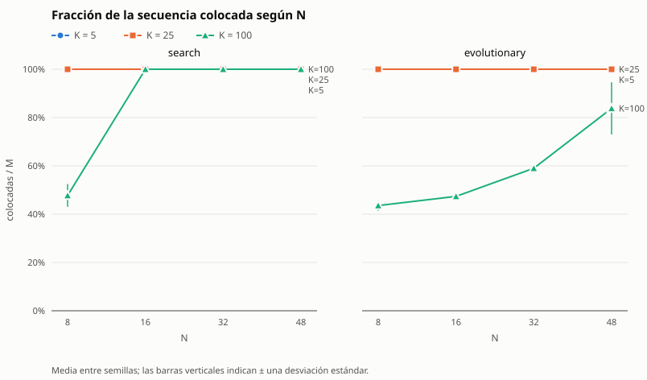
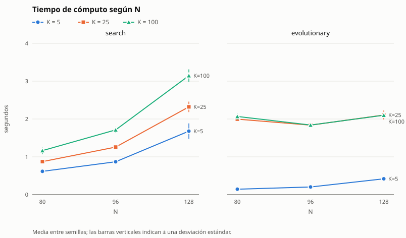

# Informe de TileUp — Tarea Corta 1 (IC-6200 Inteligencia Artificial)

**Integrantes:** María Felix Mendez Abarca, Christian Rivas y Jozafath Perez

**Descripción:** Este informe cubre:

- la formulación del motor y de los agentes de búsqueda y evolutivo;
- el ajuste de parámetros de ambos agentes;
- la comparación experimental entre ellos;
- el estudio de escalabilidad.

Las cifras salen de archivos versionados en `experiments/`, `instances/` y
`solutions/`, y se regeneran con los comandos de cada sección. Las pocas
mediciones exploratorias sin script se marcan como tales.

## Resumen

- **Motor y validador.** El motor es inmutable para los agentes (tuplas) y fusiona
  con un recorrido en anchura; la regla vive en una sola función, `colocar_en`. El
  validador es independiente del motor y lo arbitra todo.
- **Agente de búsqueda (`search`).** Búsqueda en haz iterativa (anchos 1, 2, 4, …)
  con poda por una cota admisible de ocupadas finales. La heurística que ordena el
  haz no es admisible, y se declara qué garantías se pierden. Desempata las celdas
  por bloqueos de colores que vuelven a salir y está implementada de forma
  incremental. Cuando una victoria alcanza la cota, el óptimo queda certificado.
- **Agente evolutivo (`evolutionary`).** Algoritmo genético con genes de rango por
  ficha y decodificación guiada, de modo que todo individuo es una partida legal.
  La regla de la decodificación mira toda la secuencia y se calcula de forma
  incremental. Los parámetros se fijaron con barridos y validación sobre semillas
  nuevas.
- **Comparación.** En 27 instancias (N = 4–8, K = 4–24) ambos agentes ganan todas
  las que se pueden ganar y terminan con las mismas ocupadas en total (340); cada
  uno es mejor en alguna configuración difícil.
- **Escalabilidad.** El costo lo domina el largo de la secuencia (M = 3N²) y la
  dificultad la marca K/N². Con 10 s la búsqueda completa la secuencia hasta
  N = 192 con ocupadas en la cota inferior, y deja de completarla en N = 256 con
  K ≥ 25. El evolutivo la completa hasta N = 256, con más ocupadas que la búsqueda.
- **Segunda etapa.** El proceso completo es de 3 a 70 veces más rápido según la
  instancia, con las mismas o mejores soluciones, y ya no se pasa del límite en
  tableros grandes, cosa que sí ocurría con la primera versión (sección *Mejoras de
  la segunda etapa*).
- **Concurso.** Con 10 s se usa `search` hasta N = 192 y `evolutionary` en
  tableros más grandes; con el N, K y M anunciados se confirma con
  `experiments/ensayo.py`.

## Motor y validador

El motor guarda el tablero en una tupla que no se modifica. Cada colocación crea otro tablero. La siguiente ficha
se determina por la cantidad de colocaciones realizadas. Cada sucesor aplica la
regla de fusión mediante recorrido de las fichas conectadas por arriba, abajo, izquierda y derecha del mismo color.
La suma se conserva y el nuevo tablero permite explorar sucesores sin modificar
otros estados. La comprobación de coordenadas ocurre antes de convertir al índice.
La victoria tiene prioridad sobre la derrota al colocar la última ficha.

**Una sola regla, dos formas de usarla.** La regla de colocación y fusión vive en
una sola función, `colocar_en`, que modifica una lista. `colocar` copia el estado,
llama a `colocar_en` y devuelve una tupla nueva. Los agentes nunca modifican un
estado ajeno: usan `colocar` o aplican `colocar_en` sobre listas propias (ver cada
agente), así que todas las reglas siguen viviendo solo en el motor. `jugar` llama a `colocar_en` sobre una sola lista y
lleva la cuenta de celdas vacías, así que reproducir una partida cuesta O(M) en
lugar de O(M·N²). Antes, `jugar` copiaba el tablero en cada jugada y, para
detectar la derrota, armaba la lista completa de celdas vacías. Con N = 64 la
verificación final que hace `main.py` tardaba 1,3–1,8 s, que no aparecían en
`tiempo_s` pero sí en el reloj del proceso; ahora tarda 0,03 s. Los vecinos de
cada celda se calculan una sola vez por tamaño de tablero (`tabla_vecinos`), y los
usan el recorrido de la fusión y los dos agentes.

El árbitro utiliza un diccionario de posiciones y una pila para la componente.
No comparte imports con tileup ni código de decisión con los agentes. Comprueba
formato, orden de índices, límites de posiciones, ocupación, finalización y los tres
valores del resumen. Acepta prefijos legales incompletos para el caso de tiempo
agotado. La legalidad no implica victoria ni que el agente sea competitivo.

## Agente de búsqueda

**Algoritmo.** Búsqueda en haz (*beam search*) por niveles, repetida con anchos
crecientes (1, 2, 4, 8, …) mientras quede presupuesto, y con poda por cota
admisible (ramificación y acotamiento). El nivel i contiene los estados con las
fichas 0..i−1 ya colocadas. Se descartó A* completo: el factor de ramificación es
la cantidad de celdas vacías y la profundidad es M, de modo que la frontera crece
como e! y no cabe en memoria ni en el límite de tiempo para N ≥ 3.

**Estado.** El par (tablero, i): la tupla plana de N² celdas del motor (`None` o
`(color, valor)`) y el índice de la siguiente ficha. El nodo guarda además la lista
de colocaciones para reconstruir la solución. El estado inicial es
(`tablero_vacio(N)`, 0).

**Operador de sucesión.** Para cada celda vacía c, `colocar(tablero, N, fichas[i], c)`
produce (tablero', i+1). La ramificación es exactamente e, la cantidad de celdas
vacías. Los hijos se evalúan sin construirlos y solo se construyen los que
entran al haz, aplicando `colocar_en` del motor (ver *Implementación
incremental*); el agente nunca aplica una regla propia.

**Propiedad usada.** En todo tablero alcanzable no hay dos fichas ortogonalmente
adyacentes del mismo color: una ficha que no se fusiona no toca su color, y la
fusión absorbe la componente maximal. Por eso la componente de la ficha colocada
es la celda más sus vecinos del mismo color, y al colocar en c se cumple
Δocupadas = 1 − s(c), donde s(c) ∈ {0..4} cuenta esos vecinos. El efecto de cada
movimiento se calcula sin construir el sucesor. La prueba
`tests/unit/test_propiedades.py` verifica la propiedad en 300 partidas aleatorias.

**Costo.** El costo de una acción es Δocupadas = 1 − s(c), que está en el rango
−3..1. El costo de un camino es la cantidad de celdas ocupadas, g = `ocupadas(tablero)`.
Todas las metas están a la misma profundidad M, así que minimizar g en la meta
coincide con el segundo criterio del concurso.

**Prueba de meta.** i = M: se colocaron todas las fichas (victoria, aunque la última
llene el tablero). Un estado con i < M y sin celdas vacías es un callejón sin salida
(derrota) y no se expande.

**Orden de preferencia entre soluciones.** Es el mismo del concurso: primero más
fichas colocadas, luego menos celdas ocupadas. El agente conserva siempre la mejor
solución vista, completa o parcial.

**Cota admisible (para poda).** Sean r = M − i las fichas restantes y D la cantidad
de colores distintos presentes en el tablero o en las fichas restantes. En una
meta queda al menos una ficha de cada uno de esos colores, porque la fusión nunca
elimina un color. Además, cada colocación reduce las ocupadas en a lo sumo 3. Por
tanto las ocupadas finales son al menos L = max(D, g − 3r), y h = L − g nunca
sobreestima el costo restante: es admisible. Además del argumento, la prueba
`tests/unit/test_propiedades.py` lo verifica en 8908 estados de 400 partidas
aleatorias que terminan en victoria: L nunca supera las ocupadas finales.
Uso: si ya se tiene una victoria con ocupadas = B, se poda todo estado con L ≥ B.
Esta poda no descarta ninguna solución mejor.

**Evaluación del haz (no admisible, declarada).** Para elegir qué W estados pasan
al siguiente nivel se ordena por una evaluación heurística: primero menos celdas
ocupadas y luego mayor potencial de fusión. El potencial se mide como las celdas
vacías adyacentes a fichas del color de las próximas fichas de la secuencia, con
peso decreciente según la distancia en la secuencia; la ventana y el tope se
fijaron con el procedimiento de ajuste descrito más abajo. Esta evaluación no es
una cota y el haz descarta estados, así que **se renuncia a la optimalidad y a la
completitud**: puede devolver una solución con más celdas ocupadas que la óptima,
o una derrota en una instancia que sí admite victoria. A cambio, cada nivel cuesta
O(W·e) en puntuar candidatos más O(W·N²) en construir y evaluar hasta 4·W hijos,
y el tiempo es predecible.

**Desempate por bloqueos.** Entre candidatos que dejan las mismas ocupadas, se
prefieren las celdas que tapan menos fichas de colores que vuelven a salir más
adelante en la secuencia; a igual cantidad, decide el orden de la semilla. Es el
mismo término b que usa la decodificación del evolutivo. Una ficha cuyo color
vuelve necesita una celda libre al lado para fusionarse con la siguiente de su
color; si se la tapan, esa ficha nueva tendrá que ocupar otra celda. En la primera
versión el desempate era solo el orden aleatorio de la semilla, que no distingue
una celda inofensiva de una que encierra a una ficha.

**Estados repetidos.** En cada nivel se descartan los tableros repetidos y se
conserva el primero según el orden del haz. Colocadas y ocupadas dependen solo de
los colores, así que dos estados con los mismos colores en las mismas celdas
tienen el mismo futuro en el concurso, porque el valor solo afecta `mayor`. Para
no recorrer el tablero en cada hijo, se usa una huella de Zobrist (la técnica de
las tablas de transposición del ajedrez): cada par (celda, color) tiene un número
aleatorio de 64 bits y la huella del tablero es el XOR de los números de sus
fichas. Colocar una ficha y fusionar s vecinas cambia la huella con s + 1
operaciones XOR. Si dos hijos tienen la misma huella se comparan sus colores
celda por celda, así que una colisión de la huella nunca descarta un tablero
distinto. También se probó identificar las 8 simetrías del cuadrado, pero se
descartó en el ajuste porque no mejoró los resultados y triplicó el costo.

**Implementación incremental.** La primera versión recorría el tablero completo
tres veces por cada hijo (para puntuar las celdas, para armar la llave de
repetidos y para el potencial) y copiaba la lista de colocaciones en cada hijo.
Un perfilador mostró que `colocar` era solo el 2 % del tiempo y que el resto eran
esos recorridos. La versión actual:

- guarda en cada nodo las celdas de cada color. Como nunca hay dos vecinas del
  mismo color, las celdas que fusionan con la ficha actual son las vecinas vacías
  de las fichas de su color, y se encuentran sin recorrer el tablero;
- genera los candidatos de cada nodo ya ordenados y de forma perezosa: primero
  los que fusionan y luego las celdas vacías en el orden de la semilla. Con
  `heapq.merge` recorre los de todos los nodos en el mismo orden que antes daba
  `sorted`, pero solo construye los que llega a usar (unos 8·W de cientos o miles);
- calcula el potencial a partir de las celdas de cada color próximo, sumando una
  vez el peso de cada color. Los pesos son potencias de 2 y los términos son
  enteros, así que la suma es exacta en cualquier orden;
- usa las huellas de Zobrist para los repetidos;
- guarda el camino como una lista enlazada (celda, camino del padre) y lo
  reconstruye una sola vez al final.

En una tercera ronda se midió que, con ancho 1, cada nivel construía 4 hijos
completos (copia del tablero, del índice y potencial) aunque solo sobrevive uno.
Se agregaron cinco cambios que tampoco alteran ninguna decisión:

- **Hijos sin construir.** Cada candidato se evalúa a partir del padre y del cambio
  que produce: la celda que se ocupa y las fichas que absorbe. Las ocupadas, la
  poda, la huella y el potencial no necesitan el tablero del hijo.
- **Potencial por diferencia.** Para cada color próximo, los contactos del padre
  se calculan una vez y cada hijo solo descuenta la celda ocupada y suma las
  absorbidas que quedan libres. Los pesos se calculan una vez por nivel.
- **Corte temprano.** Los candidatos llegan ordenados por ocupadas y el haz también
  se ordena primero por ocupadas: en cuanto hay W hijos y el siguiente candidato
  deja más ocupadas que el W-ésimo, ni él ni los siguientes pueden entrar.
- **Potencial solo para desempatar.** Un hijo que es el único con sus ocupadas
  queda en el mismo lugar del orden sea cual sea su potencial, así que no se
  calcula.
- **Sin buscar repetidos con un solo padre.** Dos hijos del mismo padre nunca
  tienen los mismos colores: cada uno ocupa una celda que en el otro queda vacía.
  Con W = 1 se omiten las huellas.

Solo se construyen los W hijos elegidos. El último elegido de cada padre se queda
con el tablero del padre, que ya no se usa, y lo modifica en el lugar con
`colocar_en`, la idea de "hacer la jugada sobre el mismo tablero" de los motores
de ajedrez; los demás trabajan sobre una copia. Con W = 1 el tablero no se copia
nunca.

Con el desempate por bloqueos apagado, la versión incremental decide exactamente
lo mismo que la primera: en 279 corridas (16 tamaños, 3 semillas y las variantes
de potencial, dobles, α y simetrías) dio las mismas colocaciones y la misma
cantidad de nodos, y después de la tercera ronda volvió a dar las mismas
colocaciones y nodos que la versión anterior en 366 corridas (18 tamaños, 3
semillas y 7 variantes, incluidas α, dobles y simetrías).
`tests/unit/test_incremental.py` comprueba en cada ejecución que los candidatos
perezosos salen en el mismo orden que ordenando la lista completa y que el
potencial calculado desde el padre es igual al del hijo construido.

**Presupuesto, tiempo y determinismo.** El presupuesto principal es una cantidad
de nodos expandidos, que es determinista. El tiempo es solo una red de seguridad:
el agente se detiene al 90 % de `limite_s`. Si el plazo corta una iteración, se
devuelve la mejor solución encontrada (la más larga y, a igual largo, con menos
ocupadas), que siempre es un prefijo legal. Mientras el presupuesto de nodos se
agote antes que el tiempo, la misma instancia y la misma semilla producen la
misma solución en cualquier máquina. Si es el reloj el que corta, el resultado
puede variar entre máquinas, y este caso se reporta. Los empates en la evaluación
se rompen con un orden aleatorio de celdas tomado de `random.Random(semilla)`.

**Esfuerzo.** Nodos expandidos: estados del haz a los que se les generaron
sucesores.

**Parada anticipada.** La cota en la raíz es la cantidad de colores distintos de
la secuencia. Si una victoria la alcanza, es óptima y la búsqueda termina sin
ensanchar más el haz.

**Parámetros.** Ancho máximo 1024, ventana de 10 fichas para el potencial con
pesos 1, 1/2, 1/4, …, tope de 2 celdas por color, sin término de dobles, orden
lexicográfico (ocupadas, −potencial), desempate de candidatos por bloqueos y sin
identificar simetrías. El presupuesto
es de max(M, ⌊60 000·`limite_s`/N⌋) nodos, de modo que siempre alcanza para una
pasada voraz completa si el tiempo lo permite, con corte de tiempo al 90 %. En cada nivel se
construyen como máximo 4·W hijos antes del corte del haz. La fórmula del
presupuesto no cambió en la segunda etapa: la implementación incremental hace el
mismo trabajo en menos tiempo, y en tableros grandes ahora alcanza para completar
la pasada voraz (con N = 56, 1,3 s dentro de Docker, frente a más de 9 s antes).

**Procedimiento de ajuste.** El script `experiments/ajuste_busqueda.py` corre
cada variante sobre un conjunto de ajuste del régimen de muchos colores:
(N, K) ∈ {(4,12), (5,16), (6,24), (7,32)}, M = 3N², semillas 101–103, distintas de
las de pruebas y de la batería. Usa un presupuesto fijo de 30 000 nodos para que
la comparación no dependa del reloj. El criterio es el del concurso: victorias,
luego colocadas, luego ocupadas. Cada variante cambia un solo parámetro respecto
de la base previa al ajuste (ventana 3). Los resultados están en
`experiments/ajuste/` y se regeneran con:

```
python -m experiments.ajuste_busqueda --salida experiments/ajuste/busqueda.csv
python -m experiments.ajuste_busqueda --variantes base ventana_5 ventana_10 --semillas 201 202 203 204 205 206 --salida experiments/ajuste/busqueda_validacion.csv
python -m experiments.ajuste_busqueda --variantes base ventana_10 --factor-m 5 --salida experiments/ajuste/busqueda_m5.csv
python -m experiments.ajuste_busqueda --variantes ventana_10 --factor-m 5 --presupuesto 100000 --salida experiments/ajuste/busqueda_presupuesto_100000.csv
```

El último comando se repitió con presupuestos de 30 000, 200 000 y 400 000.

| Variante (conjunto de ajuste) | Victorias | Colocadas | Ocupadas en victorias |
|---|---|---|---|
| base (ventana 3) | 12/12 | 1134 | 272 |
| sin potencial | 11/12 | 1119 | 258 |
| ventana 1 | 11/12 | 1121 | 244 |
| ventana 5 | 12/12 | 1134 | 264 |
| ventana 10 | 12/12 | 1134 | **255** |
| tope 1 / tope 4 | 12/12 / 11/12 | 1134 / 1133 | 281 / 239 |
| dobles 0,5 / 1 | 12/12 | 1134 | 272 / 271 |
| combinado α = 0,5 / 1 | 12/12 | 1134 | 272 / 273 |
| simetrías | 12/12 | 1134 | 272 (2,5× más lento) |

Quitar el potencial o acortar la ventana cuesta victorias, así que la
anticipación de colores sí aporta. Se eligió la ventana 10 y se validó con
semillas nuevas (201–206): 24/24 victorias frente a 22/24 de la base. Con
secuencias más largas (M = 5N²) obtuvo 6/12 frente a 4/12. Las simetrías no
mejoran nada y triplican el costo, por lo que se descartaron.

**Presupuesto.** Con la ventana 10 y M = 5N², pasar de 30 000 a 100 000 nodos sube
las victorias de 6/12 a 10/12, y de 200 000 a 400 000 no aporta casi nada. En una
medición exploratoria, el ritmo bajó aproximadamente como 1/N: unos 36 000
nodos/s con N = 4, 20 000 con N = 8 y 8 000 con N = 15. En
`busqueda_presupuesto_200000.csv`, un presupuesto fijo de 200 000 nodos tarda
8,9–9,2 s con N = 7, al borde del corte de tiempo (9 s con límite de 10 s). Por eso el presupuesto se escala como
60 000·`limite_s`/N: en esta máquina consume cerca de la mitad del límite, lo que
deja el doble de margen para que en una máquina más lenta termine el presupuesto
(determinista) y no el reloj.

**Ajuste del desempate por bloqueos (segunda etapa).** Con el mismo script, el
mismo presupuesto de 30 000 nodos y la ventana 10, se comparó el desempate por la
semilla con el desempate por bloqueos. Además del conjunto de ajuste se usó uno de
tableros medianos con muchos colores, (N, K) ∈ {(10,25), (10,60), (12,40),
(12,100), (16,50), (16,150), (20,100), (24,200)}, M = 3N², semillas 301–303:

```
python -m experiments.ajuste_busqueda --variantes ventana_10 ventana_10_bloqueos --salida experiments/ajuste/busqueda_bloqueos.csv
python -m experiments.ajuste_busqueda --variantes ventana_10 ventana_10_bloqueos --conjunto medianos --semillas 301 302 303 --salida experiments/ajuste/busqueda_bloqueos_medianos.csv
```

| Variante | Conjunto | Victorias | Colocadas | Ocupadas |
|---|---|---|---|---|
| desempate por la semilla | ajuste (N = 4–7) | 12/12 | 1134 | 255 |
| desempate por bloqueos | ajuste (N = 4–7) | 12/12 | 1134 | 259 |
| desempate por la semilla | medianos (N = 10–24) | 19/24 | 17 399 | 2757 |
| **desempate por bloqueos** | medianos (N = 10–24) | **22/24** | **17 773** | **2351** |

En tableros chicos la diferencia es de 4 ocupadas en 12 instancias, dentro de la
variación entre semillas. En los medianos el desempate por bloqueos gana 3
partidas más y deja 406 ocupadas menos, así que se adoptó. Al correr de nuevo la
variante base y la ventana 10 en otra máquina se obtuvieron exactamente las cifras
originales (272 y 255), lo que confirma que el agente es determinista y que la
versión incremental no cambió sus decisiones.

**Resultados.** El desempeño del agente ya ajustado está en las secciones
*Comparación experimental* y *Escalabilidad*.

### Comportamiento del agente de búsqueda al escalar

El estudio de escalabilidad con ambos agentes está en la sección
*Escalabilidad*. En resumen, para este agente:

- el costo de una colocación casi no depende de N (unos 26–36 µs con pocos
  colores, de N = 8 a N = 256), así que una pasada cuesta O(M);
- la calidad depende sobre todo de la proporción de colores por celda;
- con 10 s completa la secuencia hasta N = 192 y deja de completarla en N = 256
  con K ≥ 25 (en la primera versión, el límite estaba entre N = 50 y N = 56).

### Garantías y limitaciones del agente de búsqueda

- **Legalidad:** siempre. Solo se usan las reglas del motor (`colocar` y
  `colocar_en`), y la solución devuelta
  es la secuencia de colocaciones de un nodo alcanzado, es decir, un prefijo legal.
- **Óptimo certificado:** cuando una victoria deja ocupadas igual a la cantidad de
  colores distintos de la secuencia, es óptima. Esto ocurrió en todas las
  instancias con K ≤ 5 y en la mayoría con K ≤ N²/4.
- **Imposibilidad certificada:** si la secuencia tiene más colores distintos que
  celdas, ninguna victoria es posible. Todas las derrotas observadas en la
  comparación cumplen esta condición.
- **Sin garantía de completitud ni de optimalidad** en el resto de los casos, por
  la evaluación no admisible y el ancho limitado.
- **Determinismo condicionado al presupuesto:** con la misma instancia, semilla y
  límite el resultado es idéntico mientras el presupuesto de nodos se agote antes
  que el 90 % del límite. Ver la sección *Escalabilidad* para el rango de N en que
  ocurre.
- **Costo por tamaño:** con la implementación incremental y los hijos sin
  construir, el trabajo de cada nivel ya no depende del tamaño del tablero: con
  ancho 1 no se copia el tablero. La pasada voraz cuesta unos 35 µs por
  colocación con pocos colores tanto con N = 32 como con N = 256; en la primera
  versión, con N = 64, un nodo costaba 2,7 ms.

## Agente evolutivo

**Familia.** Algoritmo genético generacional con elitismo, implementado en
`tileup/agents/evolutionary.py` (clave `evolutionary` en la CLI). Se usa
codificación por **rangos con decodificación guiada**: el genoma no fija celdas
absolutas, sino cuánto se aparta cada colocación de la jugada que una regla local
considera mejor.

**Individuo.** Una lista de M enteros no negativos g₀ … g_{M−1}, uno por ficha
de la secuencia.

**Decodificación.** Se parte del tablero vacío y se recorren las fichas en orden.
Para la ficha i, cada celda vacía c recibe la clave
(−s(c), b(c), l(c), c), donde:

- s(c) es la cantidad de vecinos del mismo color, es decir, cuántas fichas absorbe
  la fusión;
- b(c) es la cantidad de vecinos de otro color que vuelve a salir más adelante en
  la secuencia, es decir, cuya última aparición es posterior a i (colocar ahí
  tapa un sitio de fusión futuro);
- l(c) es la cantidad de vecinos vacíos;
- el índice c rompe empates.

El orden es ascendente: primero más fusión, luego menos sitios tapados y luego
menos vecinos vacíos, para no fragmentar zonas libres. Se elige la celda que ocupa la posición mín(gᵢ, e−1) en ese orden, con e las
celdas vacías, y se aplica `colocar` del motor. Si no quedan celdas vacías la
partida termina en derrota y el resto de genes no se usa. Así **todo individuo
decodifica a una partida legal**, y el gen 0 equivale a la jugada voraz. La regla
local se eligió en una comparación exploratoria, previa al ajuste y sin script en
el repositorio, de cuatro variantes sobre 15 instancias difíciles: penalizar b(c)
subió las fichas colocadas por la regla voraz sola de 900 a 1539. Lo que aporta la
evolución por encima de esa regla sí se mide en el ajuste (variante `voraz`).

**Por qué toda la secuencia y no las 10 fichas siguientes.** En la primera versión
b(c) solo contaba los colores de las 10 fichas siguientes, y el informe registraba
sin explicar que el evolutivo perdía con K = 100 en tableros intermedios. La causa
es esa ventana: con K colores, una ficha vuelve a ver su color en promedio K fichas
después. Con K = 100 casi ningún color está dentro de una ventana de 10, la regla
lo trata como si no fuera a volver y tapa su sitio de fusión. Las fichas quedan
encerradas, nadie se fusiona y el tablero se llena. Con N = 16 y K = 100 la regla
de 10 fichas perdía las 3 partidas con unas 364 de 768 fichas colocadas; mirando
toda la secuencia las gana las 3 con 101,7 ocupadas de media, para 100 colores.
También se probaron ventanas fijas de 25, 50, 100 y 200 fichas, y mirar toda la
secuencia fue igual o mejor que todas ellas en todos los grupos, así que no queda
un parámetro de ventana que ajustar.

**Decodificación incremental.** Decodificar recorría todo el tablero en cada
ficha, O(M·N²) por evaluación, y con N = 64 una sola evaluación tardaba unos 17 s. La
versión actual lleva, para cada celda vacía, l (vecinos vacíos) y pend (vecinos de
un color que vuelve a salir), y guarda las celdas en 25 cubetas según (pend, l),
cada una ordenada por índice: es una cola de prioridad por cubetas, la estructura
del algoritmo de Dial. Para cada ficha:

- las celdas que fusionan (s > 0) son las vecinas vacías de las fichas de su color
  y se ordenan aparte; para ellas b = pend − s;
- para las demás b = pend, así que el orden (−s, b, l, c) es recorrer las cubetas
  en orden y cada cubeta por índice;
- después de colocar solo se recalculan la celda, las fichas absorbidas y sus
  vecinas; cuando un color sale por última vez, se recalculan las vecinas de sus
  fichas.

Esto solo es posible con la regla de toda la secuencia: un color deja de volver
una sola vez, cuando sale por última vez, mientras que con la ventana de 10 fichas
el estado de muchos colores cambiaba en cada ficha. La versión incremental decide
exactamente lo mismo que recorrer el tablero: se comprobó con 1080 genomas
aleatorios en 15 tamaños, y `tests/unit/test_incremental.py` lo repite en cada
ejecución. Una evaluación con N = 64 bajó de 17 s a 0,2 s.

La partida se simula sobre una lista propia del agente con `colocar_en`, sin copiar
el tablero en cada ficha, y el grupo que devuelve el motor da directamente las
fichas absorbidas. Cuando el gen es 0 (el caso más común) basta el mínimo de las
celdas que fusionan, sin ordenarlas.

**Aptitud.** f = colocadas·(N² + 1) − ocupadas. Como las ocupadas nunca superan
N², una ficha colocada más siempre pesa más que cualquier diferencia de ocupadas,
de modo que maximizar f equivale al orden del concurso (más colocadas, luego menos
ocupadas). Cada decodificación cuenta como una evaluación; el esfuerzo informado
es la cantidad de evaluaciones.

**Población inicial.** P = 40 individuos. El primero es todo ceros (la jugada voraz);
en los demás cada gen vale 0 salvo con probabilidad 0,3, en cuyo caso toma un rango
aleatorio.

**Rango aleatorio.** Distribución geométrica: r = 0 y se incrementa mientras un
número aleatorio sea menor que 0,3. Favorece desviaciones pequeñas de la jugada
voraz (P(r = 0) = 0,7, P(r = 1) = 0,21, …).

**Selección.** Torneo de tamaño 3: se toman 3 individuos al azar y gana el de mayor
aptitud.

**Variación.** Cruce de dos puntos con probabilidad 0,9 (el hijo toma de un padre los
genes fuera del segmento y del otro los de dentro). Mutación por gen con probabilidad
4/M, es decir, unas 4 colocaciones cambiadas por hijo, que reemplaza el gen por un
rango aleatorio.

**Reemplazo.** Generacional con elitismo: los 2 mejores pasan intactos y el resto
de la nueva población son hijos.

**Criterio de paro.** El primero de:

- agotar el presupuesto de max(1, ⌊180 000·`limite_s`/(M·√N)⌋) evaluaciones, que
  es determinista;
- llegar al 90 % del límite de tiempo, como red de seguridad. El plazo se revisa
  también dentro de cada evaluación, cada 16 colocaciones, porque en tableros
  grandes una sola partida simulada puede durar segundos. Si vence a mitad de la
  partida, se conserva el prefijo decodificado, que es legal. Sin esta revisión,
  con N = 40 y N = 50 el agente tardaba 10,2 s y 10,9 s con límite de 10 s;
  con ella se detiene en 9,0 s;
- encontrar una victoria con ocupadas igual a la cantidad de colores distintos de
  la secuencia, que es la cota óptima. Se revisa después de cada evaluación,
  también en la población inicial: si la jugada voraz ya es óptima, el agente
  termina con una sola evaluación. Como nadie supera la cota, la solución
  entregada es la misma que si siguiera.

Se devuelve el mejor individuo visto.

**Semilla.** Toda la aleatoriedad (población inicial, torneos, cruces, mutaciones)
sale de un único `random.Random(semilla)`. La decodificación es determinista. Con la
misma instancia, semilla y límite el resultado es idéntico mientras el presupuesto
se agote antes que el reloj.

**Presupuesto.** Cada evaluación simula M colocaciones, y el costo medido de una
colocación crece despacio con el tamaño del tablero, aproximadamente como √N. Por
eso el presupuesto es de max(1, ⌊`ritmo`·`limite_s`/(M·√N)⌋) evaluaciones, con un
`ritmo` elegido para usar como mucho la mitad del límite en el peor caso medido y
dejar el resto de margen para máquinas más lentas, igual que el criterio de la
primera versión.

El `ritmo` se calibró dos veces. En la segunda etapa se fijó en 120 000. Después de
la tercera ronda el agente era de 2 a 3 veces más rápido y, medido dentro de Docker
en instancias difíciles (donde no se detiene por el óptimo), usaba solo de 2,1 a
3,1 s de los 10. Más evaluaciones mejoran la calidad en tableros medianos: en 12
instancias medianas (el conjunto `medianos` del script, semillas 901–903, sin usar
antes) las ocupadas por encima de la cota bajaron de 171 a 130 con 1,5 veces el
presupuesto y a 117 con 2 veces. Con 2 veces el proceso llegaba a 6,4 s en Docker,
así que se eligió 1,5:
`ritmo` = 180 000, con un peor caso de 5,0 s en Docker. Con 10 s da 18 750
evaluaciones con N = 4, 3314 con N = 8, 585 con N = 16, 103 con N = 32 y 18 con
N = 64 (en la primera versión eran 15 625, 1953, 244, 30 y 3).

El presupuesto de la búsqueda no se subió: medida igual, ya usa de 3,7 a 6,1 s en
Docker en sus peores casos (haces anchos en tableros chicos), y más nodos harían
que en una máquina más lenta cortara el reloj y se perdiera el determinismo.

```
python -m experiments.ajuste_evolutivo --variantes final --conjunto medianos --semillas 901 902 903 --ritmo 120000 --salida experiments/ajuste/evolutivo_ritmo_120000.csv
python -m experiments.ajuste_evolutivo --variantes final --conjunto medianos --semillas 901 902 903 --ritmo 180000 --salida experiments/ajuste/evolutivo_ritmo_180000.csv
python -m experiments.ajuste_evolutivo --variantes final --conjunto medianos --semillas 901 902 903 --ritmo 240000 --salida experiments/ajuste/evolutivo_ritmo_240000.csv
```

| `ritmo` (conjunto de medianos, 24 instancias) | Victorias | Colocadas | Ocupadas sobre la cota (en victorias) | Tiempo total |
|---|---|---|---|---|
| 120 000 | 23/24 | 17 744 | 171 | 60,9 s |
| **180 000** | 23/24 | 17 748 | **130** | 80,0 s |
| 240 000 | 23/24 | 17 752 | 117 | 100,7 s |

Con la misma semilla, las primeras evaluaciones son idénticas sin importar el
presupuesto, así que más presupuesto nunca empeora la solución: solo agrega
intentos. En las baterías oficiales el cambio de 120 000 a 180 000 mejoró una sola
instancia (340 → 339 ocupadas en la comparación) y no empeoró ninguna, porque ahí
el evolutivo ya estaba en su techo; el costo es tiempo, y solo cuando no llega al
óptimo.

**Procedimiento de ajuste.** El script `experiments/ajuste_evolutivo.py` corre cada
variante con un presupuesto fijo de 1500 evaluaciones (independiente del reloj)
sobre el mismo conjunto de ajuste que el agente de búsqueda: (N, K) ∈ {(4,12),
(5,16), (6,24), (7,32)}, M = 3N², semillas 101–103. Se partió de una base de 2 genes
mutados y densidad inicial 0,1, y cada variante cambia un solo parámetro. El
criterio es el del concurso. Los resultados están en `experiments/ajuste/` y se
regeneran con:

```
python -m experiments.ajuste_evolutivo --salida experiments/ajuste/evolutivo.csv
python -m experiments.ajuste_evolutivo --variantes base voraz sin_cruce mutados_4 mutados_6 mutados_4_densidad_0.3 densidad_0.3 --semillas 201 202 203 204 205 206 --salida experiments/ajuste/evolutivo_validacion.csv
```

| Variante (conjunto de ajuste) | Victorias | Colocadas | Ocupadas |
|---|---|---|---|
| voraz (solo el individuo inicial) | 5/12 | 908 | 348 |
| base | 11/12 | 1103 | 292 |
| sin cruce | 11/12 | 1108 | 296 |
| población 20 / 80 | 10/12 / 10/12 | 1083 / 1096 | 293 / 295 |
| torneo 2 / 5 | 10/12 / 10/12 | 1106 / 1090 | 293 / 300 |
| 1 / 4 / 6 genes mutados | 10/12 / 11/12 / 11/12 | 1104 / 1114 / 1121 | 298 / 293 / 291 |
| rango 0,15 / 0,5 | 10/12 / 10/12 | 1093 / 1102 | 300 / 293 |
| densidad inicial 0 / 0,3 | 10/12 / 11/12 | 1088 / 1097 | 294 / 287 |
| élite 1 / 5 | 11/12 / 11/12 | 1095 / 1095 | 292 / 288 |
| 4 genes mutados + densidad 0,3 | 11/12 | 1110 | **284** |

Las diferencias entre variantes son pequeñas frente a la que hay con la regla
voraz sola. Por eso las mejores se validaron con semillas nuevas (201–206,
24 instancias):

| Variante (validación) | Victorias | Colocadas | Ocupadas |
|---|---|---|---|
| voraz | 5/24 | 1712 | 743 |
| base | 19/24 | 2239 | 598 |
| sin cruce | 20/24 | 2244 | 611 |
| 4 genes mutados | 20/24 | 2256 | 604 |
| 6 genes mutados | 19/24 | 2231 | 615 |
| densidad 0,3 | 19/24 | 2237 | 596 |
| **4 genes mutados + densidad 0,3** | **23/24** | **2261** | **598** |

Se eligió la última. La evolución es la que produce la mejora: con el mismo
presupuesto, el AG gana 23 de 24 instancias de validación y la regla voraz que
usa para decodificar solo 5. El cruce aporta poco (sin cruce: 20/24 frente a
19/24 de la base), lo que indica que la mutación es el operador principal. Se
mantiene el cruce porque no empeora el resultado y combina segmentos buenos de
distintas partidas.

**Segunda etapa del ajuste.** Con la regla de toda la secuencia se repitió el
procedimiento sobre la configuración elegida (`final`: 4 genes mutados y densidad
0,3) y se probaron cuatro ideas nuevas, una a la vez:

- `enfriamiento` e: la tasa de mutación empieza en (1 + e) veces la base y baja
  linealmente hasta (1 − e) veces según la fracción del presupuesto usada
  (explorar primero, afinar después, como el esquema decreciente de Bäck y
  Schütz). Depende de las evaluaciones y no del reloj, para no perder el
  determinismo;
- `sin_repetidos`: si un hijo es idéntico a un genoma ya evaluado (entre el 4 % y
  el 12 % de las evaluaciones), se le muta un gen más antes de evaluarlo;
- población de 80 y torneo de 5.

```
python -m experiments.ajuste_evolutivo --variantes voraz final final_enfriamiento_0.5 final_enfriamiento_0.8 final_sin_repetidos final_poblacion_80 final_torneo_5 --salida experiments/ajuste/evolutivo_ultima.csv
python -m experiments.ajuste_evolutivo --variantes voraz final final_enfriamiento_0.5 final_enfriamiento_0.8 final_sin_repetidos final_poblacion_80 final_torneo_5 --semillas 201 202 203 204 205 206 --salida experiments/ajuste/evolutivo_ultima_validacion.csv
python -m experiments.ajuste_evolutivo --variantes voraz final final_enfriamiento_0.5 final_sin_repetidos --conjunto medianos --semillas 301 302 303 --presupuesto 300 --salida experiments/ajuste/evolutivo_ultima_medianos.csv
```

| Variante | Ajuste (12) | Validación (24) | Medianos (24) |
|---|---|---|---|
| voraz (solo el individuo inicial) | 5/12, 344 ocupadas | 11/24, 687 | 21/24, 2543 |
| **final** | 12/12, **255** | 23/24, **521** | 21/24, 2411 |
| enfriamiento 0,5 | 12/12, 257 | 23/24, 526 | 21/24, 2404 |
| enfriamiento 0,8 | 12/12, 255 | 22/24, 536 | — |
| sin repetidos | 12/12, 258 | 23/24, 527 | 21/24, 2424 |
| población 80 | 12/12, 253 | 22/24, 533 | — |
| torneo 5 | 12/12, 256 | 24/24, 524 | — |

La regla nueva cambió mucho el resultado de la misma configuración: en la
validación pasó de 598 a 521 ocupadas, y la regla voraz sola pasó de 5 a 11
victorias de 24. En cambio, ninguna de las cuatro ideas mejora de forma
consistente: las diferencias son de pocas ocupadas en 24 instancias y cambian de
signo entre conjuntos. Por eso se mantuvo `final`; las opciones quedan en el
código (apagadas) para que el experimento se pueda repetir. La conclusión es que,
en este problema, la calidad depende mucho más de la regla de decodificación que
de los operadores genéticos.

**Limitaciones.** El significado de un gen depende de las colocaciones anteriores
(epistasis): el mismo rango apunta a otra celda si cambia el prefijo, y eso limita
lo que puede transmitir el cruce. Cada evaluación cuesta O(M·√N) en la práctica,
así que en tableros muy grandes el presupuesto alcanza para pocas generaciones.

## Comparación experimental

### Metodología

- **Instancias.** `generator/generate.py`: colores uniformes en 1..K, valores en
  1..9, generador aleatorio local con semilla. Nueve configuraciones:
  N ∈ {4, 6, 8} × K ∈ {4, 12, 24}, con M = 3N² y semillas 1, 2 y 3, para 27
  instancias. K cubre tres regímenes: pocos colores, una cuarta parte de las
  celdas del tablero menor y más colores que celdas en N = 4. La batería por
  defecto original (N ≤ 4, K ≤ 5) se descartó porque ambos agentes alcanzan el
  óptimo con la regla voraz y no se distinguen.
- **Ejecución.** `python -m experiments.run_all`, el comando por defecto, que
  también corre con `make experiments` y `run.ps1 -Accion experiments`. Cada
  agente recibe el mismo archivo, la misma semilla y un límite de 10 s. Se incluye
  `trivial` (primera celda libre) como referencia.
- **Validación.** Cada solución pasa por el validador independiente, y sus métricas
  deben coincidir con las de la salida estándar. Hubo 81 ejecuciones, 0 fallos y
  ninguna excedió el límite.
- **Métricas.** Colocadas, ocupadas, tiempo de `resolver` (sin arranque del
  intérprete) y esfuerzo propio (nodos expandidos o evaluaciones de aptitud), con
  media y desviación estándar muestral entre las 3 semillas.
- **Archivos.** Instancias en `instances/comparacion/`, soluciones en
  `solutions/comparacion/`, datos en `experiments/comparacion/` (`resultados.csv`
  y `resumen.csv`) y gráficas en `experiments/plots/`. La tabla se genera con
  `python -m experiments.reporte --resumen experiments/comparacion/resumen.csv`.

La semilla cambia a la vez la instancia y la aleatoriedad del agente, así que la
dispersión mezcla ambas fuentes. El agente de búsqueda solo usa la semilla para
desempates, por lo que su dispersión es casi toda debida a la instancia.

### Resultados

| N | K | M | Agente | Victorias | Colocadas | Ocupadas | Tiempo (s) | Esfuerzo |
|---|---|---|---|---|---|---|---|---|
| 4 | 4 | 48 | `search` | 3/3 | 48.0 ± 0.0 | 4.0 ± 0.0 | 0.001 ± 0.000 | 48 ± 0 nodos |
| 4 | 4 | 48 | `evolutionary` | 3/3 | 48.0 ± 0.0 | 4.0 ± 0.0 | 0.000 ± 0.000 | 1 ± 0 evaluaciones |
| 4 | 4 | 48 | `trivial` | 0/3 | 33.7 ± 9.3 | 16.0 ± 0.0 | 0.000 ± 0.000 | 34 ± 9 colocaciones |
| 4 | 12 | 48 | `search` | 3/3 | 48.0 ± 0.0 | 12.3 ± 0.6 | 1.163 ± 1.137 | 45658 ± 44729 nodos |
| 4 | 12 | 48 | `evolutionary` | 3/3 | 48.0 ± 0.0 | 12.7 ± 1.2 | 1.732 ± 1.532 | 10658 ± 9634 evaluaciones |
| 4 | 12 | 48 | `trivial` | 0/3 | 17.3 ± 0.6 | 16.0 ± 0.0 | 0.000 ± 0.000 | 17 ± 1 colocaciones |
| 4 | 24 | 48 | `search` | 0/3 | 20.7 ± 2.1 | 16.0 ± 0.0 | 1.070 ± 0.194 | 39324 ± 4261 nodos |
| 4 | 24 | 48 | `evolutionary` | 0/3 | 20.7 ± 2.1 | 16.0 ± 0.0 | 1.819 ± 0.253 | 18750 ± 0 evaluaciones |
| 4 | 24 | 48 | `trivial` | 0/3 | 16.7 ± 0.6 | 16.0 ± 0.0 | 0.000 ± 0.000 | 17 ± 1 colocaciones |
| 6 | 4 | 108 | `search` | 3/3 | 108.0 ± 0.0 | 4.0 ± 0.0 | 0.003 ± 0.000 | 108 ± 0 nodos |
| 6 | 4 | 108 | `evolutionary` | 3/3 | 108.0 ± 0.0 | 4.0 ± 0.0 | 0.001 ± 0.000 | 1 ± 0 evaluaciones |
| 6 | 4 | 108 | `trivial` | 1/3 | 98.3 ± 8.7 | 35.3 ± 1.2 | 0.000 ± 0.000 | 98 ± 9 colocaciones |
| 6 | 12 | 108 | `search` | 3/3 | 108.0 ± 0.0 | 12.0 ± 0.0 | 0.004 ± 0.000 | 108 ± 0 nodos |
| 6 | 12 | 108 | `evolutionary` | 3/3 | 108.0 ± 0.0 | 12.0 ± 0.0 | 0.001 ± 0.000 | 1 ± 0 evaluaciones |
| 6 | 12 | 108 | `trivial` | 0/3 | 43.0 ± 3.6 | 36.0 ± 0.0 | 0.000 ± 0.000 | 43 ± 4 colocaciones |
| 6 | 24 | 108 | `search` | 3/3 | 108.0 ± 0.0 | 25.0 ± 1.0 | 2.764 ± 0.955 | 84761 ± 26395 nodos |
| 6 | 24 | 108 | `evolutionary` | 3/3 | 108.0 ± 0.0 | 24.3 ± 0.6 | 2.165 ± 1.417 | 4034 ± 2773 evaluaciones |
| 6 | 24 | 108 | `trivial` | 0/3 | 39.0 ± 2.6 | 36.0 ± 0.0 | 0.000 ± 0.000 | 39 ± 3 colocaciones |
| 8 | 4 | 192 | `search` | 3/3 | 192.0 ± 0.0 | 4.0 ± 0.0 | 0.007 ± 0.004 | 192 ± 0 nodos |
| 8 | 4 | 192 | `evolutionary` | 3/3 | 192.0 ± 0.0 | 4.0 ± 0.0 | 0.002 ± 0.001 | 1 ± 0 evaluaciones |
| 8 | 4 | 192 | `trivial` | 1/3 | 166.7 ± 24.5 | 60.7 ± 5.8 | 0.001 ± 0.000 | 167 ± 25 colocaciones |
| 8 | 12 | 192 | `search` | 3/3 | 192.0 ± 0.0 | 12.0 ± 0.0 | 0.009 ± 0.002 | 192 ± 0 nodos |
| 8 | 12 | 192 | `evolutionary` | 3/3 | 192.0 ± 0.0 | 12.0 ± 0.0 | 0.002 ± 0.000 | 1 ± 0 evaluaciones |
| 8 | 12 | 192 | `trivial` | 0/3 | 76.3 ± 4.0 | 64.0 ± 0.0 | 0.001 ± 0.000 | 76 ± 4 colocaciones |
| 8 | 24 | 192 | `search` | 3/3 | 192.0 ± 0.0 | 24.0 ± 0.0 | 0.009 ± 0.002 | 192 ± 0 nodos |
| 8 | 24 | 192 | `evolutionary` | 3/3 | 192.0 ± 0.0 | 24.0 ± 0.0 | 0.041 ± 0.035 | 31 ± 26 evaluaciones |
| 8 | 24 | 192 | `trivial` | 0/3 | 68.3 ± 3.1 | 64.0 ± 0.0 | 0.000 ± 0.000 | 68 ± 3 colocaciones |


### Lectura

- **Victorias.** Ambos agentes ganan las 24 instancias ganables. `trivial` gana 2.
  Las 3 instancias restantes (N = 4, K = 24) son imposibles: tienen 21–22 colores
  distintos para 16 celdas y en una victoria quedaría al menos una ficha por color.
  Ahí los dos agentes llegan a la misma derrota, 20,7 ± 2,1 colocadas.
- **Ocupadas.** Con K = 4, con K = 12 en N ≥ 6 y con K = 24 en N = 8, los dos
  agentes terminan con ocupadas = K, que es la cota inferior, es decir, el óptimo.
  Las diferencias aparecen en el régimen más ajustado y van en las dos
  direcciones:
  - N = 4, K = 12: búsqueda 12,3 ± 0,6 frente a evolutivo 13,0 ± 1,0;
  - N = 6, K = 24: búsqueda 25,0 ± 1,0 frente a evolutivo 24,3 ± 0,6.

  En total suman 340 ocupadas la búsqueda y 339 el evolutivo en las 27 instancias. En la primera
  versión la búsqueda dominaba (341 frente a 358) porque la regla de
  decodificación del evolutivo miraba solo 10 fichas hacia adelante.
- **Tiempo y esfuerzo.** Cuando la regla voraz ya alcanza la cota, los dos agentes
  terminan en milésimas de segundo, porque ambos certifican el óptimo y se
  detienen: la búsqueda tras M nodos y el evolutivo tras una sola evaluación. En
  las configuraciones ajustadas los dos agotan buena parte de su presupuesto: la
  búsqueda tarda 2,6 ± 0,9 s con N = 6, K = 24 (ensancha el haz hasta
  84 761 ± 26 395 nodos) y el evolutivo 2,2 ± 1,4 s. Las unidades de esfuerzo
  no son comparables entre agentes: un nodo expandido es una colocación, y una
  evaluación es una partida completa de M colocaciones.
- **Dispersión.** La del evolutivo en ocupadas bajó con la regla nueva: con N = 8,
  K = 24 pasó de ± 4,4 a ± 0, porque ahora la regla voraz sola ya llega al óptimo.
- **Conclusión.** En tableros chicos los dos agentes están empatados en calidad y
  cada uno gana alguna configuración. La búsqueda aprovecha la información local
  exacta (Δocupadas) y la poda admisible; el evolutivo, una regla de decodificación
  que protege los sitios de fusión de todos los colores que vuelven. La sección
  *Escalabilidad* muestra cómo se separan al crecer el tablero.

## Escalabilidad

### Diseño

Hay cinco baterías construidas con el generador parametrizado
(`python -m generator.generate --n N --k K --m M --semilla S`). Todas usan ambos
agentes, semillas 1–3 y límite de 10 s. Las 288 ejecuciones pasaron por el
validador, sin fallos.

| Batería | N | K | M | Ejecuciones | Carpeta de datos |
|---|---|---|---|---|---|
| Principal | 8, 16, 32, 48 | 5, 25, 100 | 3N² | 72 | `experiments/escalabilidad/` |
| Límite | 50, 56, 64 | 5, 25, 100 | 3N² | 54 | `experiments/escalabilidad_limite/` |
| Extrema | 80, 96, 128 | 5, 25, 100 | 3N² | 54 | `experiments/escalabilidad_extrema/` |
| Máxima | 160, 192, 256 | 5, 25, 100 | 3N² | 54 | `experiments/escalabilidad_maxima/` |
| M fijo | 8, 16, 32 | 5, 25, 100 | 192 | 54 | `experiments/escalabilidad_m_fijo/` |

La batería con M fijo separa el efecto del tamaño del tablero del de la longitud
de la secuencia, que en las otras crecen juntos. Las baterías extrema y máxima se
agregaron en la segunda etapa, porque con los agentes nuevos la búsqueda ya
completaba N = 64, y después N = 128, y había que encontrar su nuevo límite.
Instancias y soluciones están en `instances/<batería>/` y `solutions/<batería>/`,
salvo las de la batería máxima: pesan unos 60 MB, no se versionan y se regeneran
exactamente con su comando, porque el generador es determinista. Sus resultados
sí están en `experiments/escalabilidad_maxima/`. Comandos:

```
python -m experiments.run_all --agentes search evolutionary --n 8 16 32 48 --k 5 25 100 --salida experiments/escalabilidad --instancias instances/escalabilidad --soluciones solutions/escalabilidad
python -m experiments.run_all --agentes search evolutionary --n 50 56 64 --k 5 25 100 --salida experiments/escalabilidad_limite --instancias instances/escalabilidad_limite --soluciones solutions/escalabilidad_limite
python -m experiments.run_all --agentes search evolutionary --n 80 96 128 --k 5 25 100 --salida experiments/escalabilidad_extrema --instancias instances/escalabilidad_extrema --soluciones solutions/escalabilidad_extrema
python -m experiments.run_all --agentes search evolutionary --n 160 192 256 --k 5 25 100 --salida experiments/escalabilidad_maxima --instancias instances/escalabilidad_maxima --soluciones solutions/escalabilidad_maxima
python -m experiments.run_all --agentes search evolutionary --n 8 16 32 --k 5 25 100 --m-fijo 192 --salida experiments/escalabilidad_m_fijo --instancias instances/escalabilidad_m_fijo --soluciones solutions/escalabilidad_m_fijo
```

Las tablas y gráficas se generan con `experiments/reporte.py --agentes search evolutionary`.

### Resultados (M = 3N²)

| N | K | M | Agente | Victorias | Colocadas | Ocupadas | Tiempo (s) | Esfuerzo |
|---|---|---|---|---|---|---|---|---|
| 8 | 5 | 192 | `search` | 3/3 | 192.0 ± 0.0 | 5.0 ± 0.0 | 0.005 ± 0.001 | 192 ± 0 nodos |
| 8 | 5 | 192 | `evolutionary` | 3/3 | 192.0 ± 0.0 | 5.0 ± 0.0 | 0.001 ± 0.000 | 1 ± 0 evaluaciones |
| 8 | 25 | 192 | `search` | 3/3 | 192.0 ± 0.0 | 25.0 ± 0.0 | 0.008 ± 0.001 | 192 ± 0 nodos |
| 8 | 25 | 192 | `evolutionary` | 3/3 | 192.0 ± 0.0 | 25.0 ± 0.0 | 0.069 ± 0.072 | 55 ± 59 evaluaciones |
| 8 | 100 | 192 | `search` | 0/3 | 94.0 ± 9.2 | 64.0 ± 0.0 | 2.660 ± 0.145 | 75000 ± 0 nodos |
| 8 | 100 | 192 | `evolutionary` | 0/3 | 94.3 ± 7.0 | 64.0 ± 0.0 | 1.536 ± 0.126 | 3314 ± 0 evaluaciones |
| 16 | 5 | 768 | `search` | 3/3 | 768.0 ± 0.0 | 5.0 ± 0.0 | 0.026 ± 0.002 | 768 ± 0 nodos |
| 16 | 5 | 768 | `evolutionary` | 3/3 | 768.0 ± 0.0 | 5.0 ± 0.0 | 0.006 ± 0.002 | 1 ± 0 evaluaciones |
| 16 | 25 | 768 | `search` | 3/3 | 768.0 ± 0.0 | 25.0 ± 0.0 | 0.042 ± 0.008 | 768 ± 0 nodos |
| 16 | 25 | 768 | `evolutionary` | 3/3 | 768.0 ± 0.0 | 25.0 ± 0.0 | 0.385 ± 0.344 | 67 ± 60 evaluaciones |
| 16 | 100 | 768 | `search` | 3/3 | 768.0 ± 0.0 | 100.3 ± 0.6 | 0.795 ± 1.281 | 13012 ± 21207 nodos |
| 16 | 100 | 768 | `evolutionary` | 3/3 | 768.0 ± 0.0 | 100.7 ± 1.2 | 2.275 ± 1.338 | 362 ± 207 evaluaciones |
| 32 | 5 | 3072 | `search` | 3/3 | 3072.0 ± 0.0 | 5.0 ± 0.0 | 0.109 ± 0.003 | 3072 ± 0 nodos |
| 32 | 5 | 3072 | `evolutionary` | 3/3 | 3072.0 ± 0.0 | 5.0 ± 0.0 | 0.020 ± 0.001 | 1 ± 0 evaluaciones |
| 32 | 25 | 3072 | `search` | 3/3 | 3072.0 ± 0.0 | 25.0 ± 0.0 | 0.169 ± 0.028 | 3072 ± 0 nodos |
| 32 | 25 | 3072 | `evolutionary` | 3/3 | 3072.0 ± 0.0 | 27.3 ± 0.6 | 2.887 ± 0.200 | 103 ± 0 evaluaciones |
| 32 | 100 | 3072 | `search` | 3/3 | 3072.0 ± 0.0 | 100.0 ± 0.0 | 0.256 ± 0.044 | 3072 ± 0 nodos |
| 32 | 100 | 3072 | `evolutionary` | 3/3 | 3072.0 ± 0.0 | 108.0 ± 0.0 | 3.266 ± 0.187 | 103 ± 0 evaluaciones |
| 48 | 5 | 6912 | `search` | 3/3 | 6912.0 ± 0.0 | 5.0 ± 0.0 | 0.277 ± 0.012 | 6912 ± 0 nodos |
| 48 | 5 | 6912 | `evolutionary` | 3/3 | 6912.0 ± 0.0 | 5.0 ± 0.0 | 0.047 ± 0.001 | 1 ± 0 evaluaciones |
| 48 | 25 | 6912 | `search` | 3/3 | 6912.0 ± 0.0 | 25.0 ± 0.0 | 0.340 ± 0.017 | 6912 ± 0 nodos |
| 48 | 25 | 6912 | `evolutionary` | 3/3 | 6912.0 ± 0.0 | 32.7 ± 3.2 | 2.456 ± 0.092 | 37 ± 0 evaluaciones |
| 48 | 100 | 6912 | `search` | 3/3 | 6912.0 ± 0.0 | 100.0 ± 0.0 | 0.484 ± 0.025 | 6912 ± 0 nodos |
| 48 | 100 | 6912 | `evolutionary` | 3/3 | 6912.0 ± 0.0 | 110.3 ± 2.3 | 3.159 ± 0.309 | 37 ± 0 evaluaciones |
| 50 | 5 | 7500 | `search` | 3/3 | 7500.0 ± 0.0 | 5.0 ± 0.0 | 0.320 ± 0.015 | 7500 ± 0 nodos |
| 50 | 5 | 7500 | `evolutionary` | 3/3 | 7500.0 ± 0.0 | 5.0 ± 0.0 | 0.070 ± 0.012 | 1 ± 0 evaluaciones |
| 50 | 25 | 7500 | `search` | 3/3 | 7500.0 ± 0.0 | 25.0 ± 0.0 | 0.459 ± 0.021 | 7500 ± 0 nodos |
| 50 | 25 | 7500 | `evolutionary` | 3/3 | 7500.0 ± 0.0 | 34.0 ± 1.7 | 2.809 ± 0.183 | 33 ± 0 evaluaciones |
| 50 | 100 | 7500 | `search` | 3/3 | 7500.0 ± 0.0 | 100.0 ± 0.0 | 0.546 ± 0.064 | 7500 ± 0 nodos |
| 50 | 100 | 7500 | `evolutionary` | 3/3 | 7500.0 ± 0.0 | 113.0 ± 1.0 | 3.062 ± 0.232 | 33 ± 0 evaluaciones |
| 56 | 5 | 9408 | `search` | 3/3 | 9408.0 ± 0.0 | 5.0 ± 0.0 | 0.362 ± 0.020 | 9408 ± 0 nodos |
| 56 | 5 | 9408 | `evolutionary` | 3/3 | 9408.0 ± 0.0 | 5.0 ± 0.0 | 0.071 ± 0.008 | 1 ± 0 evaluaciones |
| 56 | 25 | 9408 | `search` | 3/3 | 9408.0 ± 0.0 | 25.0 ± 0.0 | 0.477 ± 0.011 | 9408 ± 0 nodos |
| 56 | 25 | 9408 | `evolutionary` | 3/3 | 9408.0 ± 0.0 | 35.0 ± 2.6 | 2.402 ± 0.191 | 25 ± 0 evaluaciones |
| 56 | 100 | 9408 | `search` | 3/3 | 9408.0 ± 0.0 | 100.0 ± 0.0 | 0.569 ± 0.057 | 9408 ± 0 nodos |
| 56 | 100 | 9408 | `evolutionary` | 3/3 | 9408.0 ± 0.0 | 115.0 ± 1.0 | 2.441 ± 0.033 | 25 ± 0 evaluaciones |
| 64 | 5 | 12288 | `search` | 3/3 | 12288.0 ± 0.0 | 5.0 ± 0.0 | 0.412 ± 0.011 | 12288 ± 0 nodos |
| 64 | 5 | 12288 | `evolutionary` | 3/3 | 12288.0 ± 0.0 | 5.0 ± 0.0 | 0.086 ± 0.006 | 1 ± 0 evaluaciones |
| 64 | 25 | 12288 | `search` | 3/3 | 12288.0 ± 0.0 | 25.0 ± 0.0 | 0.581 ± 0.033 | 12288 ± 0 nodos |
| 64 | 25 | 12288 | `evolutionary` | 3/3 | 12288.0 ± 0.0 | 38.7 ± 3.2 | 2.097 ± 0.051 | 18 ± 0 evaluaciones |
| 64 | 100 | 12288 | `search` | 3/3 | 12288.0 ± 0.0 | 100.0 ± 0.0 | 0.747 ± 0.031 | 12288 ± 0 nodos |
| 64 | 100 | 12288 | `evolutionary` | 3/3 | 12288.0 ± 0.0 | 122.7 ± 3.5 | 2.203 ± 0.068 | 18 ± 0 evaluaciones |
| 80 | 5 | 19200 | `search` | 3/3 | 19200.0 ± 0.0 | 5.0 ± 0.0 | 0.616 ± 0.008 | 19200 ± 0 nodos |
| 80 | 5 | 19200 | `evolutionary` | 3/3 | 19200.0 ± 0.0 | 5.0 ± 0.0 | 0.144 ± 0.015 | 1 ± 0 evaluaciones |
| 80 | 25 | 19200 | `search` | 3/3 | 19200.0 ± 0.0 | 25.0 ± 0.0 | 0.873 ± 0.004 | 19200 ± 0 nodos |
| 80 | 25 | 19200 | `evolutionary` | 3/3 | 19200.0 ± 0.0 | 39.3 ± 2.5 | 1.996 ± 0.012 | 10 ± 0 evaluaciones |
| 80 | 100 | 19200 | `search` | 3/3 | 19200.0 ± 0.0 | 100.0 ± 0.0 | 1.164 ± 0.094 | 19200 ± 0 nodos |
| 80 | 100 | 19200 | `evolutionary` | 3/3 | 19200.0 ± 0.0 | 132.0 ± 3.6 | 2.067 ± 0.092 | 10 ± 0 evaluaciones |
| 96 | 5 | 27648 | `search` | 3/3 | 27648.0 ± 0.0 | 5.0 ± 0.0 | 0.870 ± 0.035 | 27648 ± 0 nodos |
| 96 | 5 | 27648 | `evolutionary` | 3/3 | 27648.0 ± 0.0 | 5.0 ± 0.0 | 0.203 ± 0.002 | 1 ± 0 evaluaciones |
| 96 | 25 | 27648 | `search` | 3/3 | 27648.0 ± 0.0 | 25.0 ± 0.0 | 1.258 ± 0.023 | 27648 ± 0 nodos |
| 96 | 25 | 27648 | `evolutionary` | 3/3 | 27648.0 ± 0.0 | 40.3 ± 1.5 | 1.837 ± 0.039 | 6 ± 0 evaluaciones |
| 96 | 100 | 27648 | `search` | 3/3 | 27648.0 ± 0.0 | 100.0 ± 0.0 | 1.712 ± 0.085 | 27648 ± 0 nodos |
| 96 | 100 | 27648 | `evolutionary` | 3/3 | 27648.0 ± 0.0 | 132.0 ± 2.6 | 1.840 ± 0.009 | 6 ± 0 evaluaciones |
| 128 | 5 | 49152 | `search` | 3/3 | 49152.0 ± 0.0 | 5.0 ± 0.0 | 1.678 ± 0.206 | 49152 ± 0 nodos |
| 128 | 5 | 49152 | `evolutionary` | 3/3 | 49152.0 ± 0.0 | 5.0 ± 0.0 | 0.418 ± 0.004 | 1 ± 0 evaluaciones |
| 128 | 25 | 49152 | `search` | 3/3 | 49152.0 ± 0.0 | 25.0 ± 0.0 | 2.321 ± 0.139 | 49152 ± 0 nodos |
| 128 | 25 | 49152 | `evolutionary` | 3/3 | 49152.0 ± 0.0 | 39.7 ± 3.5 | 2.105 ± 0.119 | 3 ± 0 evaluaciones |
| 128 | 100 | 49152 | `search` | 3/3 | 49152.0 ± 0.0 | 100.0 ± 0.0 | 3.145 ± 0.167 | 49152 ± 0 nodos |
| 128 | 100 | 49152 | `evolutionary` | 3/3 | 49152.0 ± 0.0 | 147.7 ± 2.1 | 2.100 ± 0.068 | 3 ± 0 evaluaciones |
| 160 | 5 | 76800 | `search` | 3/3 | 76800.0 ± 0.0 | 5.0 ± 0.0 | 2.054 ± 0.013 | 76800 ± 0 nodos |
| 160 | 5 | 76800 | `evolutionary` | 3/3 | 76800.0 ± 0.0 | 5.0 ± 0.0 | 0.669 ± 0.014 | 1 ± 0 evaluaciones |
| 160 | 25 | 76800 | `search` | 3/3 | 76800.0 ± 0.0 | 25.0 ± 0.0 | 3.005 ± 0.023 | 76800 ± 0 nodos |
| 160 | 25 | 76800 | `evolutionary` | 3/3 | 76800.0 ± 0.0 | 39.7 ± 2.9 | 0.969 ± 0.028 | 1 ± 0 evaluaciones |
| 160 | 100 | 76800 | `search` | 3/3 | 76800.0 ± 0.0 | 100.0 ± 0.0 | 4.137 ± 0.261 | 76800 ± 0 nodos |
| 160 | 100 | 76800 | `evolutionary` | 3/3 | 76800.0 ± 0.0 | 169.3 ± 8.6 | 1.033 ± 0.007 | 1 ± 0 evaluaciones |
| 192 | 5 | 110592 | `search` | 3/3 | 110592.0 ± 0.0 | 5.0 ± 0.0 | 3.031 ± 0.054 | 110592 ± 0 nodos |
| 192 | 5 | 110592 | `evolutionary` | 3/3 | 110592.0 ± 0.0 | 5.0 ± 0.0 | 1.151 ± 0.008 | 1 ± 0 evaluaciones |
| 192 | 25 | 110592 | `search` | 3/3 | 110592.0 ± 0.0 | 25.0 ± 0.0 | 4.407 ± 0.091 | 110592 ± 0 nodos |
| 192 | 25 | 110592 | `evolutionary` | 3/3 | 110592.0 ± 0.0 | 43.7 ± 2.1 | 1.702 ± 0.017 | 1 ± 0 evaluaciones |
| 192 | 100 | 110592 | `search` | 3/3 | 110592.0 ± 0.0 | 100.0 ± 0.0 | 6.398 ± 0.355 | 110592 ± 0 nodos |
| 192 | 100 | 110592 | `evolutionary` | 3/3 | 110592.0 ± 0.0 | 189.3 ± 2.5 | 1.844 ± 0.011 | 1 ± 0 evaluaciones |
| 256 | 5 | 196608 | `search` | 3/3 | 196608.0 ± 0.0 | 5.0 ± 0.0 | 5.537 ± 0.032 | 196608 ± 0 nodos |
| 256 | 5 | 196608 | `evolutionary` | 3/3 | 196608.0 ± 0.0 | 5.0 ± 0.0 | 2.999 ± 0.010 | 1 ± 0 evaluaciones |
| 256 | 25 | 196608 | `search` | 0/3 | 191290.7 ± 1884.4 | 25.0 ± 0.0 | 7.861 ± 0.001 | 191291 ± 1884 nodos |
| 256 | 25 | 196608 | `evolutionary` | 3/3 | 196608.0 ± 0.0 | 43.0 ± 2.6 | 4.370 ± 0.012 | 1 ± 0 evaluaciones |
| 256 | 100 | 196608 | `search` | 0/3 | 125092.0 ± 362.8 | 100.0 ± 0.0 | 7.847 ± 0.001 | 125092 ± 363 nodos |
| 256 | 100 | 196608 | `evolutionary` | 3/3 | 196608.0 ± 0.0 | 210.7 ± 1.5 | 4.476 ± 0.012 | 1 ± 0 evaluaciones |







### Resultados (M = 192 fijo)

| N | K | M | Agente | Victorias | Colocadas | Ocupadas | Tiempo (s) | Esfuerzo |
|---|---|---|---|---|---|---|---|---|
| 8 | 5 | 192 | `search` | 3/3 | 192.0 ± 0.0 | 5.0 ± 0.0 | 0.005 ± 0.000 | 192 ± 0 nodos |
| 8 | 5 | 192 | `evolutionary` | 3/3 | 192.0 ± 0.0 | 5.0 ± 0.0 | 0.001 ± 0.000 | 1 ± 0 evaluaciones |
| 8 | 25 | 192 | `search` | 3/3 | 192.0 ± 0.0 | 25.0 ± 0.0 | 0.008 ± 0.000 | 192 ± 0 nodos |
| 8 | 25 | 192 | `evolutionary` | 3/3 | 192.0 ± 0.0 | 25.0 ± 0.0 | 0.067 ± 0.072 | 55 ± 59 evaluaciones |
| 8 | 100 | 192 | `search` | 0/3 | 94.0 ± 9.2 | 64.0 ± 0.0 | 2.382 ± 0.135 | 75000 ± 0 nodos |
| 8 | 100 | 192 | `evolutionary` | 0/3 | 94.3 ± 7.0 | 64.0 ± 0.0 | 1.337 ± 0.129 | 3314 ± 0 evaluaciones |
| 16 | 5 | 192 | `search` | 3/3 | 192.0 ± 0.0 | 5.0 ± 0.0 | 0.006 ± 0.000 | 192 ± 0 nodos |
| 16 | 5 | 192 | `evolutionary` | 3/3 | 192.0 ± 0.0 | 5.0 ± 0.0 | 0.001 ± 0.000 | 1 ± 0 evaluaciones |
| 16 | 25 | 192 | `search` | 3/3 | 192.0 ± 0.0 | 25.0 ± 0.0 | 0.008 ± 0.000 | 192 ± 0 nodos |
| 16 | 25 | 192 | `evolutionary` | 3/3 | 192.0 ± 0.0 | 25.0 ± 0.0 | 0.001 ± 0.000 | 1 ± 0 evaluaciones |
| 16 | 100 | 192 | `search` | 3/3 | 192.0 ± 0.0 | 87.3 ± 1.5 | 0.008 ± 0.000 | 192 ± 0 nodos |
| 16 | 100 | 192 | `evolutionary` | 3/3 | 192.0 ± 0.0 | 87.3 ± 1.5 | 0.232 ± 0.222 | 223 ± 214 evaluaciones |
| 32 | 5 | 192 | `search` | 3/3 | 192.0 ± 0.0 | 5.0 ± 0.0 | 0.007 ± 0.000 | 192 ± 0 nodos |
| 32 | 5 | 192 | `evolutionary` | 3/3 | 192.0 ± 0.0 | 5.0 ± 0.0 | 0.002 ± 0.000 | 1 ± 0 evaluaciones |
| 32 | 25 | 192 | `search` | 3/3 | 192.0 ± 0.0 | 25.0 ± 0.0 | 0.008 ± 0.000 | 192 ± 0 nodos |
| 32 | 25 | 192 | `evolutionary` | 3/3 | 192.0 ± 0.0 | 25.0 ± 0.0 | 0.002 ± 0.000 | 1 ± 0 evaluaciones |
| 32 | 100 | 192 | `search` | 3/3 | 192.0 ± 0.0 | 87.3 ± 1.5 | 0.008 ± 0.000 | 192 ± 0 nodos |
| 32 | 100 | 192 | `evolutionary` | 3/3 | 192.0 ± 0.0 | 87.3 ± 1.5 | 0.178 ± 0.092 | 146 ± 73 evaluaciones |

### Lectura

**¿Qué parámetro domina el costo?** El largo de la secuencia, M. Las filas con
K = 5 lo muestran con claridad, porque ahí ambos agentes certifican el óptimo con
su jugada voraz: la búsqueda tras M nodos y el evolutivo tras una sola evaluación.

- **Con M fijo**, la búsqueda tarda 0,005, 0,006 y 0,006 s para N = 8, 16 y 32: el
  tamaño del tablero no influye. En la primera versión tardaba 0,009, 0,023 y
  0,076 s, creciendo como N², porque cada colocación recorría el tablero entero.
- **Con M = 3N²**, la pasada voraz tarda 0,005, 0,024, 0,11, 0,23, 0,43, 0,93,
  1,73, 3,03 y 5,54 s para N = 8, 16, 32, 48, 64, 96, 128, 192 y 256. Son 26–36 µs
  por colocación en todos los tamaños: el costo es O(M) = O(N²). En la primera
  versión era O(M·N²) = O(N⁴).
- **El evolutivo** con K = 5 hace una sola evaluación: 0,001 s con N = 8, 0,019 s
  con N = 32, 0,084 s con N = 64, 0,48 s con N = 128 y 3,0 s con N = 256. Por
  colocación cuesta de 5 a 15 µs; crece algo en tableros enormes porque sus cubetas
  ordenadas tienen hasta N² celdas.
- **Con más colores la colocación cuesta más:** con N = 192 la búsqueda tarda 3,0,
  4,4 y 6,4 s para K = 5, 25 y 100, porque hay más colores próximos para los que
  calcular el potencial.

**K no cambia el orden del costo, sino la dificultad.** La medida útil es la
proporción K/N²:

- **K/N² pequeño** (K = 5 en todos los N; K = 25 desde N = 8): ambos agentes llegan
  a la cota o muy cerca.
- **Más colores distintos que celdas:** la victoria es imposible. Es el caso de
  N = 8, K = 100, con 86–89 colores distintos para 64 celdas; los dos agentes
  colocan unas 94 fichas antes de llenar el tablero.
- **Entre esos extremos** la búsqueda llega a la cota o a una unidad de ella (100,3
  ocupadas con N = 16, K = 100 y exactamente 100 desde N = 32), casi siempre con la
  pasada voraz. Solo una semilla de N = 16, K = 100 tuvo que ensanchar el haz.

**¿Dónde deja de terminar la búsqueda dentro del límite?** Con 10 s:

- **N ≤ 192:** todas las ejecuciones completan la secuencia, en 6,6 s o menos, con
  ocupadas iguales a la cota inferior en todas las instancias ganables menos una
  (101 en una semilla de N = 16, K = 100): el óptimo certificado.
- **N = 256:** con K = 5 todavía completa (5,5 s). Con K = 25 entrega un prefijo
  legal del 96–98 % de las 196 608 fichas y con K = 100 del 64 %, porque el reloj
  la detiene a los 7,9 s. Ese plazo ya descuenta el tiempo que necesitan la
  verificación y la escritura de una solución tan larga, y el proceso completo
  termina en 8,5 s.
- **El límite práctico de la búsqueda con 10 s está entre N = 192 y N = 256.** En la
  primera versión estaba entre N = 50 y N = 56.

**¿Cómo se comporta el evolutivo en ese régimen?**

- **Completa la secuencia en todos los tamaños probados**, hasta N = 256, en 4,5 s
  o menos.
- **Su calidad se degrada con N** porque le quedan menos generaciones: su
  presupuesto le da 37 evaluaciones con N = 48, 18 con N = 64, 6 con N = 96, 3
  con N = 128 y 1 desde N = 160. Con K = 25 sus ocupadas pasan de 25,0 (N = 16) a 27,3, 32,7, 38,7,
  40,3, 39,7, 43,7 y 43,0 (N = 32, 48, 64, 96, 128, 192 y 256); con K = 100, de
  100,7 a 108,0, 110,3, 122,7, 132,0, 147,7, 189,3 y 210,7. La búsqueda se mantiene
  en 25 y 100 mientras termina. Con tan pocas evaluaciones el evolutivo depende
  casi solo de su regla de decodificación, que es buena pero no tan precisa como
  el haz.
- **En N = 256 con K ≥ 25 es el único que completa la secuencia**, y como el primer
  criterio del concurso son las fichas colocadas, ahí conviene el evolutivo.

**Dispersión.** El tiempo de la búsqueda es bimodal cuando tiene que ensanchar el
haz (N = 16, K = 100), no porque el agente sea inestable. La dispersión del
evolutivo en ocupadas en tableros grandes (de ± 1,5 a ± 8,6) refleja que con 1 a
18 evaluaciones el resultado depende de la semilla.

## Mejoras de la segunda etapa

La primera versión ya cubría la rúbrica. En la segunda etapa se midió con un
perfilador dónde se gastaba el tiempo, se probaron técnicas conocidas y se
adoptaron solo las que mejoraban en experimentos de presupuesto fijo. Los cambios
están descritos en las secciones de cada componente:

| Cambio | Componente | Qué resolvió |
|---|---|---|
| Regla de toda la secuencia en b(c) | evolutivo | perdía con K = 100 porque la ventana de 10 fichas no veía volver a los colores |
| Decodificación incremental con cubetas | evolutivo | recorría el tablero en cada ficha: O(M·N²) por evaluación |
| Nuevo presupuesto, 180 000·límite/(M·√N) | evolutivo | sigue el costo medido y usa el tiempo que sobraba |
| Índice por color, candidatos perezosos, huellas de Zobrist y camino enlazado | búsqueda | recorría el tablero tres veces por hijo y copiaba el camino en cada hijo |
| Desempate por bloqueos | búsqueda | elegía al azar entre celdas que dejaban las mismas ocupadas |
| `colocar_en` y `jugar` sin copias | motor | la verificación final hacía que el proceso superara el límite |
| `experiments/ensayo.py` | experimentos | elegir el agente del concurso con el N, K y M anunciados |
| `.dockerignore` sin instancias ni soluciones | Docker | `run.ps1` enviaba unos 60 MB a Docker en cada ejecución: el comando completo bajó de 11–14 s a 4–5 s en un clon limpio |

### Antes y después en la misma máquina

La primera versión (commit `c646028` de `main`) y la actual se corrieron en la
misma computadora, una después de la otra, sin otra carga y con las mismas
baterías. Los resultados de la primera versión están en `experiments/antes/`.

| Batería | Agente | Primera versión | Versión actual |
|---|---|---|---|
| Comparación (27 instancias) | `search` | 24/27 victorias, 341 ocupadas, 0,61 s | 24/27, 340 ocupadas, **0,56 s** |
| Comparación (27 instancias) | `evolutionary` | 24/27, 358 ocupadas, 1,24 s | 24/27, **339** ocupadas, **0,64 s** |
| Principal, N = 8–48 (36) | `search` | 33/36, 1496 ocupadas, 3,81 s | 33/36, 1453 ocupadas, **0,43 s** |
| Principal, N = 8–48 (36) | `evolutionary` | 24/36, 11 478 ocupadas, 6,04 s | **33/36**, **1539** ocupadas, **1,34 s** |
| Límite, N = 50–64 (27) | `search` | 8/27, 164 923 de 262 764 fichas, 8,85 s | **27/27**, todas las fichas, **0,50 s** |
| Límite, N = 50–64 (27) | `evolutionary` | 15/27 y 3 ejecuciones descartadas por tiempo | **27/27**, **0** descartadas, **1,69 s** |
| M fijo (27) | `search` | 24/27, 990 ocupadas, 1,05 s | 24/27, 986 ocupadas, **0,27 s** |
| M fijo (27) | `evolutionary` | 24/27, 1248 ocupadas, 1,98 s | 24/27, **986** ocupadas, **0,20 s** |

Las ocupadas son la suma de todas las ejecuciones válidas y el tiempo es la media
de `tiempo_s`. La versión actual incluye todas las rondas. La tercera no cambió
ningún resultado (mismas colocadas, ocupadas y nodos); el presupuesto mayor del
evolutivo mejoró una instancia de la comparación y alarga sus tiempos cuando no
llega al óptimo.

**Velocidad por unidad de esfuerzo** (sin carga, Python nativo, versión actual):

| N | Evolutivo: ms por evaluación (K = 5) | Búsqueda: nodos por segundo |
|---|---|---|
| 4 | — | 31 871 → 50 798 |
| 8 | 2,9 → 0,9 | 14 593 → 31 268 |
| 16 | 40,9 → 3,9 | 6773 → 18 439 |
| 32 | 648 → 18,8 | 2143 → 22 068 |
| 48 | 3351 → 45,6 | 1098 → 24 947 |
| 64 | 17 117 → 87,6 | 373 → 24 677 |

Los dos agentes son más rápidos que la primera versión en todos los tamaños: el
evolutivo hasta 195 veces y la búsqueda hasta 66 veces con N = 64.

**El reloj del proceso completo.** La primera versión detenía al agente al 90 % del
límite, pero después `main.py` verificaba la partida copiando el tablero en cada
jugada. Con N = 64 y K = 100, el evolutivo paraba a los 9,02 s y la verificación
tardaba otros 2,90 s: el proceso completo duraba 12,07 s con un límite de 10. En la
batería de límite eso descartó sus 3 ejecuciones con N = 64, K = 100. Con la versión
actual el mismo caso tarda 3,51 s en total (1,79 s con la búsqueda).

### Tercera ronda: el reloj del proceso completo

El tercer criterio del concurso es el tiempo, y cuando los agentes llegan al
óptimo certificado es el que decide. En una ejecución típica (N = 20) el agente
tardaba 0,12 s pero el proceso completo 0,24 s: arrancar Python cuesta unos 40 ms,
y solo importar el programa costaba 60 ms, de los que unos 45 ms eran
`dataclasses` (que en Python 3.14 importa `inspect`) y 30 ms `argparse`. Se hizo:

- `Instancia`, `Resultado` y `ResultadoPartida` pasaron a ser `namedtuple` o una
  clase simple, sin `dataclasses`;
- `main.py` lee la forma habitual `--opcion valor` sin `argparse`; cualquier otra
  forma (ayuda, `--opcion=valor`, valores inválidos) pasa por `argparse` con sus
  mensajes de siempre. Una prueba comprueba que los dos caminos leen lo mismo;
- `main.py` importa solo el agente que se va a usar;
- los cambios de cada agente descritos en sus secciones.

Ninguno cambia una decisión: la búsqueda dio las mismas colocaciones y nodos en
366 corridas, y el evolutivo las mismas soluciones en 135 (con igual o menos
evaluaciones, porque para antes al llegar al óptimo).

**Proceso completo** (`python -m tileup.main`, límite 10 s, misma máquina; la
primera versión es la mediana de 5 ejecuciones y la actual la de 9, porque el
tiempo de una misma ejecución varía hasta un 30 % por la carga de la máquina):

| Instancia | Agente | Primera versión | Versión actual |
|---|---|---|---|
| N = 12, K = 30, M = 432 | `search` | 6,87 s, 31 ocupadas | **0,14 s**, 30 ocupadas (óptimo) |
| N = 12, K = 30, M = 432 | `evolutionary` | 8,03 s, 46 ocupadas | **0,11 s**, 30 ocupadas (óptimo) |
| N = 20, K = 50, M = 1200 | `search` | 0,50 s, 50 ocupadas | **0,17 s**, 50 ocupadas |
| N = 20, K = 50, M = 1200 | `evolutionary` | 8,34 s, 239 ocupadas | **1,88 s**, 50 ocupadas |
| N = 32, K = 100, M = 3072 | `search` | 9,36 s, 102 ocupadas | **0,27 s**, 100 ocupadas |
| N = 32, K = 100, M = 3072 | `evolutionary` | 7,56 s, 1796 de 3072 fichas | **3,23 s**, todas, 106 ocupadas |
| N = 64, K = 25, M = 12 288 | `search` | **10,04 s**, 4288 de 12 288 fichas | **0,96 s**, todas, 25 ocupadas |
| N = 64, K = 25, M = 12 288 | `evolutionary` | **10,63 s**, 9216 de 12 288 fichas | **2,53 s**, todas, 36 ocupadas |

Con la primera versión, los dos agentes superaban el límite de 10 s con N = 64.

### Preparación del concurso

En el concurso se anuncian N, K y M, cada grupo elige un agente y se ordena por
fichas colocadas, luego ocupadas y luego tiempo. `experiments/ensayo.py` genera
instancias con esos valores, corre ambos agentes como en el concurso (midiendo el
reloj del proceso completo), valida cada solución y cuenta qué agente gana cada
ronda. Como los valores todavía no se conocen, se ensayaron siete tamaños
plausibles con 5 semillas cada uno (`experiments/preparacion_concurso/`):

| N | K | M | `search`: victorias, ocupadas, reloj | `evolutionary`: victorias, ocupadas, reloj | Rondas ganadas (de 5) | Recomendado |
|---|---|---|---|---|---|---|
| 6 | 24 | 108 | 5/5, 25.2, 4.10 s | 5/5, 24.2, 2.33 s | search 1 – evolutionary 4 | `evolutionary` |
| 8 | 20 | 192 | 5/5, 20.0, 0.12 s | 5/5, 20.0, 0.13 s | search 2 – evolutionary 3 | `evolutionary` |
| 10 | 40 | 300 | 5/5, 40.2, 0.73 s | 5/5, 40.0, 0.37 s | search 4 – evolutionary 1 | `search` |
| 12 | 60 | 432 | 5/5, 60.2, 0.65 s | 5/5, 60.0, 0.75 s | search 4 – evolutionary 1 | `search` |
| 16 | 80 | 768 | 5/5, 80.0, 0.16 s | 5/5, 80.6, 2.77 s | search 5 – evolutionary 0 | `search` |
| 20 | 50 | 1200 | 5/5, 50.0, 0.17 s | 5/5, 50.0, 1.51 s | search 4 – evolutionary 1 | `search` |
| 32 | 100 | 3072 | 5/5, 100.0, 0.31 s | 5/5, 108.0, 3.13 s | search 5 – evolutionary 0 | `search` |

- **Tableros chicos y muy difíciles** (N = 6, K = 24: 24 colores en 36 celdas):
  conviene el evolutivo, que deja menos ocupadas (24,2 frente a 25,2).
- **Tableros fáciles** (N = 8, K = 20): los dos llegan al óptimo y el tiempo
  decide por milésimas de segundo.
- **Con N = 10 y 12**, la búsqueda gana 4 de 5 rondas: casi siempre empata en
  ocupadas y termina antes, aunque en una ronda el evolutivo deja una ficha menos.
- **Desde N = 16**, la búsqueda gana todas o casi todas: iguala o mejora las
  ocupadas y tarda entre 9 y 17 veces menos.

Cuando se anuncien los valores reales, el comando es:

```
python -m experiments.ensayo --n N --k K --m M --limite 10 --semillas 1 2 3 4 5 6 7 8 9 10
```

### Lo que se probó y se descartó

- **Mutación con enfriamiento** (Bäck y Schütz), **evitar genomas repetidos**,
  **población de 80** y **torneo de 5** en el evolutivo: ninguna mejora de forma
  consistente (sección *Agente evolutivo*). El torneo de 5 ganó una partida más en
  la validación, pero en un tercer conjunto de semillas nuevas empató en
  victorias y dejó más ocupadas (46/48 y 1057 frente a 1050 en tableros chicos;
  22/24 y 2399 frente a 2398 en medianos), así que se mantuvo el torneo de 3:

  ```
  python -m experiments.ajuste_evolutivo --variantes final final_torneo_5 --semillas 301 302 303 304 305 306 307 308 309 310 311 312 --salida experiments/ajuste/evolutivo_ultima_torneo.csv
  python -m experiments.ajuste_evolutivo --variantes final final_torneo_5 --conjunto medianos --semillas 401 402 403 --presupuesto 300 --salida experiments/ajuste/evolutivo_ultima_torneo_medianos.csv
  ```

- **Bajar el presupuesto de la búsqueda** para tableros chicos: con 75 000 nodos en
  lugar de 150 000, en 36 instancias de N = 4–7 con M = 5N² ganaba 22 partidas en
  lugar de 26. Por eso la fórmula del presupuesto de la búsqueda se dejó igual.
- **Ventanas fijas** de 25, 50, 100 y 200 fichas para la regla del evolutivo: toda
  la secuencia fue igual o mejor que todas.

### Referencias

- A. L. Zobrist (1970), huellas para tablas de transposición:
  <https://www.chessprogramming.org/Zobrist_Hashing>.
- R. Dial (1969), cola de prioridad por cubetas: <https://en.wikipedia.org/wiki/Bucket_queue>.
- Evaluación incremental (delta evaluation; Ross, Corne y Fang, 1994), en notas de
  búsqueda local: <https://imada.sdu.dk/u/march/Teaching/AY2010-2011/DM811/Slides/dm811-lec11.pdf>.
- J. C. Bean (1994), codificación con decodificador (random keys), revisada en
  <https://arxiv.org/pdf/2506.02120>.
- Tasas de mutación decrecientes (Bäck y Schütz) y su análisis:
  <https://arxiv.org/pdf/1808.05566>.
- Búsqueda en haz en rompecabezas de un jugador como SameGame (Baier y Winands):
  <https://dke.maastrichtuniversity.nl/m.winands/documents/CIG2012_paper_32.pdf>.

## Pruebas y verificación

`python -m pytest -q` ejecuta 114 pruebas, que también pasan dentro de Docker con
`run.ps1 -Accion test` y `make test`.

- **Motor:** fusión de dos fichas, de una componente de tres o más (incluida la
  componente completa a través de varias celdas), colocación sin fusión, colores
  distintos y diagonales que no se fusionan, conservación de la suma, inmutabilidad
  del estado, derrota, victoria al llenar el tablero con la última ficha,
  colocaciones fuera del tablero o sobre celdas ocupadas.
- **Entrada y salida:** parser con archivos mal formados, que dan un mensaje
  legible y código de salida distinto de cero; escritura de soluciones por la CLI.
- **Validador:** acepta soluciones legales y rechaza celdas ocupadas, posiciones
  fuera de rango, índices fuera de orden, movimientos después del final y
  resúmenes falsos.
- **Propiedades:** no adyacencia del mismo color y admisibilidad de la cota.
- **Agentes:** piezas internas de cada uno (evaluación, decodificación,
  operadores). En integración, cada agente resuelve instancias por la CLI y su
  solución pasa por el validador, con las mismas métricas que la salida estándar.
  También se comprueban el determinismo (misma semilla, misma solución), el
  límite de tiempo (incluida una sola evaluación muy larga), el presupuesto y la
  batería experimental.
- **Equivalencia de las versiones incrementales** (`tests/unit/test_incremental.py`):
  la decodificación incremental del evolutivo elige las mismas celdas que una
  decodificación directa que recorre todo el tablero, con genomas aleatorios en
  tableros de 1×1 a 10×10; los candidatos perezosos de la búsqueda salen en el
  mismo orden que ordenando la lista completa, con y sin el desempate por
  bloqueos; el potencial que la búsqueda calcula desde el padre es igual al del
  hijo construido, con y sin el término de dobles; la detección de repetidos
  compara colores y no valores, y no se confunde cuando dos tableros distintos
  tienen la misma huella.
- **Línea de comandos:** la lectura rápida de argumentos da lo mismo que
  `argparse`, y las formas no habituales pasan por `argparse`.
- **Ensayo del concurso** (`tests/integration/test_ensayo.py`): corre ambos agentes
  con una instancia pequeña, valida y produce una recomendación.

## Conclusiones

1. **La formulación importa más que el algoritmo.** Dos propiedades del juego
   simplifican el problema:
   - nunca hay dos fichas vecinas del mismo color, así que una colocación cambia
     las ocupadas en 1 − (vecinos del mismo color);
   - las ocupadas finales tienen una cota inferior barata y admisible.

   Con ellas la búsqueda evalúa cada movimiento al instante y certifica muchos
   óptimos. La primera propiedad es también la que permite las versiones
   incrementales: las celdas que fusionan son las vecinas de las fichas de un color.
2. **La regla de decodificación pesa más que los operadores genéticos.** Cambiar
   "las próximas 10 fichas" por "toda la secuencia" convirtió en victorias, con el
   mismo presupuesto, las derrotas del evolutivo con K = 100; en la batería
   principal pasó de 24 a 33 victorias. Ninguna variante de mutación, población o
   torneo movió el resultado más allá del ruido.
3. **Un agente puede aprender del otro.** El desempate por bloqueos que se le pasó
   a la búsqueda viene de la regla del evolutivo, y le dio 3 victorias más en
   tableros medianos.
4. **El costo lo domina el largo de la secuencia; la dificultad la marca K/N².**
   Con las versiones incrementales y los hijos sin construir, el costo de una
   colocación casi no depende de N, y el límite práctico de la búsqueda con 10 s
   pasó de N ≈ 50 a N ≈ 192–256. Las
   instancias con más colores distintos que celdas no admiten victoria, y la cota
   lo detecta.
5. **El tiempo que importa es el del proceso completo.** La primera versión medía
   solo el agente y en tableros grandes el proceso superaba el límite; ahora la
   verificación cuesta O(M) y el proceso termina con holgura.
6. **Limitaciones:**
   - la búsqueda no garantiza optimalidad ni completitud fuera de los casos que
     certifica la cota;
   - ambos agentes pierden el determinismo entre máquinas cuando el reloj corta
     antes que el presupuesto, lo que con 10 s ocurre con N = 256 en la búsqueda;
   - con N ≥ 64 al evolutivo le quedan 12 evaluaciones o menos y queda cerca de
     su regla de decodificación.
