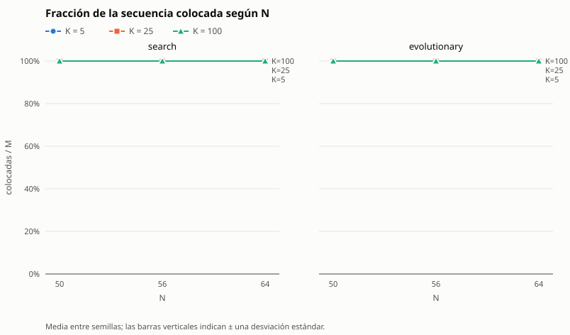

# Informe de TileUp — Tarea Corta 1 (IC-6200 Inteligencia Artificial)

**Integrantes:** María Felix Mendez Abarca, Christian Rivas y Jozafath Perez

**Descripción:** Este informe cubre:

- la formulación del motor y de los agentes de búsqueda y evolutivo;
- el ajuste de parámetros de ambos agentes;
- la comparación experimental entre ellos;
- el estudio de escalabilidad.

Las cifras salen de archivos versionados en `experiments/`, `instances/` y
`solutions/`, y se regeneran con los comandos de cada sección. Las pocas
mediciones exploratorias sin script se marcan como tales.

## Resumen

- **Motor y validador.** El motor es inmutable (tuplas) y fusiona con un recorrido
  en anchura. El validador es independiente del motor y lo arbitra todo.
- **Agente de búsqueda (`search`).** Búsqueda en haz iterativa (anchos 1, 2, 4, …)
  con poda por una cota admisible de ocupadas finales. La heurística que ordena el
  haz no es admisible, y se declara qué garantías se pierden. Cuando una victoria
  alcanza la cota, el óptimo queda certificado.
- **Agente evolutivo (`evolutionary`).** Algoritmo genético con genes de rango por
  ficha y decodificación guiada, de modo que todo individuo es una partida legal.
  Los parámetros se fijaron con un barrido y una validación sobre semillas nuevas.
- **Comparación.** En 27 instancias (N = 4–8, K = 4–24) ambos agentes ganan todas
  las que se pueden ganar. La búsqueda iguala o mejora al evolutivo en ocupadas y
  suele ser más rápida.
- **Escalabilidad.** El costo crece como O(M·N²) = O(N⁴) con M = 3N², y la
  dificultad la marca K/N². Con 10 s la búsqueda completa la secuencia hasta
  N = 50 y no desde N = 56. El evolutivo degrada su calidad mucho antes, pero
  completa más fichas en tableros muy grandes.
- **Concurso.** Con 10 s se usa `search` hasta N = 50 y `evolutionary` desde
  N = 56.

## Motor y validador

El motor guarda el tablero en una tupla que no se modifica. Cada colocación crea otro tablero. La siguiente ficha
se determina por la cantidad de colocaciones realizadas. Cada sucesor aplica la
regla de fusión mediante recorrido de las fichas conectadas por arriba, abajo, izquierda y derecha del mismo color.
La suma se conserva y el nuevo tablero permite explorar sucesores sin modificar
otros estados. La comprobación de coordenadas ocurre antes de convertir al índice.
La victoria tiene prioridad sobre la derrota al colocar la última ficha.

El árbitro utiliza un diccionario de posiciones y una pila para la componente.
No comparte imports con tileup ni código de decisión con los agentes. Comprueba
formato, orden de índices, límites de posiciones, ocupación, finalización y los tres
valores del resumen. Acepta prefijos legales incompletos para el caso de tiempo
agotado. La legalidad no implica victoria ni que el agente sea competitivo.

## Agente de búsqueda

**Algoritmo.** Búsqueda en haz (*beam search*) por niveles, repetida con anchos
crecientes (1, 2, 4, 8, …) mientras quede presupuesto, y con poda por cota
admisible (ramificación y acotamiento). El nivel i contiene los estados con las
fichas 0..i−1 ya colocadas. Se descartó A* completo: el factor de ramificación es
la cantidad de celdas vacías y la profundidad es M, de modo que la frontera crece
como e! y no cabe en memoria ni en el límite de tiempo para N ≥ 3.

**Estado.** El par (tablero, i): la tupla plana de N² celdas del motor (`None` o
`(color, valor)`) y el índice de la siguiente ficha. El nodo guarda además la lista
de colocaciones para reconstruir la solución. El estado inicial es
(`tablero_vacio(N)`, 0).

**Operador de sucesión.** Para cada celda vacía c, `colocar(tablero, N, fichas[i], c)`
produce (tablero', i+1). La ramificación es exactamente e, la cantidad de celdas
vacías. El agente nunca modifica un tablero: siempre usa `colocar`.

**Propiedad usada.** En todo tablero alcanzable no hay dos fichas ortogonalmente
adyacentes del mismo color: una ficha que no se fusiona no toca su color, y la
fusión absorbe la componente maximal. Por eso la componente de la ficha colocada
es la celda más sus vecinos del mismo color, y al colocar en c se cumple
Δocupadas = 1 − s(c), donde s(c) ∈ {0..4} cuenta esos vecinos. El efecto de cada
movimiento se calcula sin construir el sucesor. La prueba
`tests/unit/test_propiedades.py` verifica la propiedad en 300 partidas aleatorias.

**Costo.** El costo de una acción es Δocupadas = 1 − s(c), que está en el rango
−3..1. El costo de un camino es la cantidad de celdas ocupadas, g = `ocupadas(tablero)`.
Todas las metas están a la misma profundidad M, así que minimizar g en la meta
coincide con el segundo criterio del concurso.

**Prueba de meta.** i = M: se colocaron todas las fichas (victoria, aunque la última
llene el tablero). Un estado con i < M y sin celdas vacías es un callejón sin salida
(derrota) y no se expande.

**Orden de preferencia entre soluciones.** Es el mismo del concurso: primero más
fichas colocadas, luego menos celdas ocupadas. El agente conserva siempre la mejor
solución vista, completa o parcial.

**Cota admisible (para poda).** Sean r = M − i las fichas restantes y D la cantidad
de colores distintos presentes en el tablero o en las fichas restantes. En una
meta queda al menos una ficha de cada uno de esos colores, porque la fusión nunca
elimina un color. Además, cada colocación reduce las ocupadas en a lo sumo 3. Por
tanto las ocupadas finales son al menos L = max(D, g − 3r), y h = L − g nunca
sobreestima el costo restante: es admisible. Además del argumento, la prueba
`tests/unit/test_propiedades.py` lo verifica en 8908 estados de 400 partidas
aleatorias que terminan en victoria: L nunca supera las ocupadas finales.
Uso: si ya se tiene una victoria con ocupadas = B, se poda todo estado con L ≥ B.
Esta poda no descarta ninguna solución mejor.

**Evaluación del haz (no admisible, declarada).** Para elegir qué W estados pasan
al siguiente nivel se ordena por una evaluación heurística: primero menos celdas
ocupadas y luego mayor potencial de fusión. El potencial se mide como las celdas
vacías adyacentes a fichas del color de las próximas fichas de la secuencia, con
peso decreciente según la distancia en la secuencia; la ventana y el tope se
fijaron con el procedimiento de ajuste descrito más abajo. Esta evaluación no es
una cota y el haz descarta estados, así que **se renuncia a la optimalidad y a la
completitud**: puede devolver una solución con más celdas ocupadas que la óptima,
o una derrota en una instancia que sí admite victoria. A cambio, cada nivel cuesta
O(W·e) en puntuar candidatos más O(W·N²) en construir y evaluar hasta 4·W hijos,
y el tiempo es predecible.

**Estados repetidos.** En cada nivel se descartan los tableros repetidos y se
conserva el primero según el orden del haz. Colocadas y ocupadas dependen solo de
los colores, así que la llave es la tupla de colores del tablero. Dos estados con
los mismos colores tienen el mismo futuro en el concurso, porque el valor solo
afecta `mayor`. También se probó identificar las 8 simetrías del cuadrado, pero
se descartó en el ajuste porque no mejoró los resultados y triplicó el costo.

**Presupuesto, tiempo y determinismo.** El presupuesto principal es una cantidad
de nodos expandidos, que es determinista. El tiempo es solo una red de seguridad:
el agente se detiene al 90 % de `limite_s`. Si el plazo corta una iteración, se
devuelve la mejor solución encontrada (la más larga y, a igual largo, con menos
ocupadas), que siempre es un prefijo legal. Mientras el presupuesto de nodos se
agote antes que el tiempo, la misma instancia y la misma semilla producen la
misma solución en cualquier máquina. Si es el reloj el que corta, el resultado
puede variar entre máquinas, y este caso se reporta. Los empates en la evaluación
se rompen con un orden aleatorio de celdas tomado de `random.Random(semilla)`.

**Esfuerzo.** Nodos expandidos: estados del haz a los que se les generaron
sucesores.

**Parada anticipada.** La cota en la raíz es la cantidad de colores distintos de
la secuencia. Si una victoria la alcanza, es óptima y la búsqueda termina sin
ensanchar más el haz.

**Parámetros.** Ancho máximo 1024, ventana de 10 fichas para el potencial con
pesos 1, 1/2, 1/4, …, tope de 2 celdas por color, sin término de dobles, orden
lexicográfico (ocupadas, −potencial) y sin identificar simetrías. El presupuesto
es de max(M, ⌊60 000·`limite_s`/N⌋) nodos, de modo que siempre alcanza para una
pasada voraz completa si el tiempo lo permite, con corte de tiempo al 90 %. En cada nivel se
construyen como máximo 4·W hijos antes del corte del haz. Para no ordenar todos los
candidatos en cada nivel, se extraen los 8·W menores con un montículo
(`heapq.nsmallest`) y solo se ordena el resto si los repetidos los agotan. El orden
resultante es idéntico al de ordenar la lista completa: se verificó que las
soluciones no cambian. Con esto la pasada voraz con N = 50 baja de más de 9 s a
7,0 s.

**Procedimiento de ajuste.** El script `experiments/ajuste_busqueda.py` corre
cada variante sobre un conjunto de ajuste del régimen de muchos colores:
(N, K) ∈ {(4,12), (5,16), (6,24), (7,32)}, M = 3N², semillas 101–103, distintas de
las de pruebas y de la batería. Usa un presupuesto fijo de 30 000 nodos para que
la comparación no dependa del reloj. El criterio es el del concurso: victorias,
luego colocadas, luego ocupadas. Cada variante cambia un solo parámetro respecto
de la base previa al ajuste (ventana 3). Los resultados están en
`experiments/ajuste/` y se regeneran con:

```
python -m experiments.ajuste_busqueda --salida experiments/ajuste/busqueda.csv
python -m experiments.ajuste_busqueda --variantes base ventana_5 ventana_10 --semillas 201 202 203 204 205 206 --salida experiments/ajuste/busqueda_validacion.csv
python -m experiments.ajuste_busqueda --variantes base ventana_10 --factor-m 5 --salida experiments/ajuste/busqueda_m5.csv
python -m experiments.ajuste_busqueda --variantes ventana_10 --factor-m 5 --presupuesto 100000 --salida experiments/ajuste/busqueda_presupuesto_100000.csv
```

El último comando se repitió con presupuestos de 30 000, 200 000 y 400 000.

| Variante (conjunto de ajuste) | Victorias | Colocadas | Ocupadas en victorias |
|---|---|---|---|
| base (ventana 3) | 12/12 | 1134 | 272 |
| sin potencial | 11/12 | 1119 | 258 |
| ventana 1 | 11/12 | 1121 | 244 |
| ventana 5 | 12/12 | 1134 | 264 |
| ventana 10 | 12/12 | 1134 | **255** |
| tope 1 / tope 4 | 12/12 / 11/12 | 1134 / 1133 | 281 / 239 |
| dobles 0,5 / 1 | 12/12 | 1134 | 272 / 271 |
| combinado α = 0,5 / 1 | 12/12 | 1134 | 272 / 273 |
| simetrías | 12/12 | 1134 | 272 (2,5× más lento) |

Quitar el potencial o acortar la ventana cuesta victorias, así que la
anticipación de colores sí aporta. Se eligió la ventana 10 y se validó con
semillas nuevas (201–206): 24/24 victorias frente a 22/24 de la base. Con
secuencias más largas (M = 5N²) obtuvo 6/12 frente a 4/12. Las simetrías no
mejoran nada y triplican el costo, por lo que se descartaron.

**Presupuesto.** Con la ventana 10 y M = 5N², pasar de 30 000 a 100 000 nodos sube
las victorias de 6/12 a 10/12, y de 200 000 a 400 000 no aporta casi nada. En una
medición exploratoria, el ritmo bajó aproximadamente como 1/N: unos 36 000
nodos/s con N = 4, 20 000 con N = 8 y 8 000 con N = 15. En
`busqueda_presupuesto_200000.csv`, un presupuesto fijo de 200 000 nodos tarda
8,9–9,2 s con N = 7, al borde del corte de tiempo (9 s con límite de 10 s). Por eso el presupuesto se escala como
60 000·`limite_s`/N: en esta máquina consume cerca de la mitad del límite, lo que
deja el doble de margen para que en una máquina más lenta termine el presupuesto
(determinista) y no el reloj.

**Resultados.** El desempeño del agente ya ajustado está en las secciones
*Comparación experimental* y *Escalabilidad*.

### Comportamiento del agente de búsqueda al escalar

El estudio de escalabilidad con ambos agentes está en la sección
*Escalabilidad*. En resumen, para este agente:

- el costo de una pasada crece como O(M·N²);
- la calidad depende sobre todo de la proporción de colores por celda;
- con 10 s completa la secuencia hasta N = 50 y deja de completarla en N = 56.

### Garantías y limitaciones del agente de búsqueda

- **Legalidad:** siempre. Solo se usa `colocar` del motor, y la solución devuelta
  es la secuencia de colocaciones de un nodo alcanzado, es decir, un prefijo legal.
- **Óptimo certificado:** cuando una victoria deja ocupadas igual a la cantidad de
  colores distintos de la secuencia, es óptima. Esto ocurrió en todas las
  instancias con K ≤ 5 y en la mayoría con K ≤ N²/4.
- **Imposibilidad certificada:** si la secuencia tiene más colores distintos que
  celdas, ninguna victoria es posible. Todas las derrotas observadas en la
  comparación cumplen esta condición.
- **Sin garantía de completitud ni de optimalidad** en el resto de los casos, por
  la evaluación no admisible y el ancho limitado.
- **Determinismo condicionado al presupuesto:** con la misma instancia, semilla y
  límite el resultado es idéntico mientras el presupuesto de nodos se agote antes
  que el 90 % del límite. Ver la sección *Escalabilidad* para el rango de N en que
  ocurre.
- **Costo por tamaño:** cada expansión recorre y copia el tablero completo, así
  que una pasada cuesta O(M·N²). Una evaluación incremental (vecinos y potencial
  actualizados por cambio) extendería el rango de N en el que termina a tiempo.

## Agente evolutivo

**Familia.** Algoritmo genético generacional con elitismo, implementado en
`tileup/agents/evolutionary.py` (clave `evolutionary` en la CLI). Se usa
codificación por **rangos con decodificación guiada**: el genoma no fija celdas
absolutas, sino cuánto se aparta cada colocación de la jugada que una regla local
considera mejor.

**Individuo.** Una lista de M enteros no negativos g₀ … g_{M−1}, uno por ficha
de la secuencia.

**Decodificación.** Se parte del tablero vacío y se recorren las fichas en orden.
Para la ficha i, cada celda vacía c recibe la clave
(−s(c), b(c), l(c), c), donde:

- s(c) es la cantidad de vecinos del mismo color, es decir, cuántas fichas absorbe
  la fusión;
- b(c) es la cantidad de vecinos de otro color que aparece entre las 10 fichas
  siguientes (colocar ahí tapa un sitio de fusión futuro);
- l(c) es la cantidad de vecinos vacíos;
- el índice c rompe empates.

El orden es ascendente: primero más fusión, luego menos sitios tapados y luego
menos vecinos vacíos, para no fragmentar zonas libres. Se elige la celda que ocupa la posición mín(gᵢ, e−1) en ese orden, con e las
celdas vacías, y se aplica `colocar` del motor. Si no quedan celdas vacías la
partida termina en derrota y el resto de genes no se usa. Así **todo individuo
decodifica a una partida legal**, y el gen 0 equivale a la jugada voraz. La regla
local se eligió en una comparación exploratoria, previa al ajuste y sin script en
el repositorio, de cuatro variantes sobre 15 instancias difíciles: penalizar b(c)
subió las fichas colocadas por la regla voraz sola de 900 a 1539. Lo que aporta la
evolución por encima de esa regla sí se mide en el ajuste (variante `voraz`).

**Aptitud.** f = colocadas·(N² + 1) − ocupadas. Como las ocupadas nunca superan
N², una ficha colocada más siempre pesa más que cualquier diferencia de ocupadas,
de modo que maximizar f equivale al orden del concurso (más colocadas, luego menos
ocupadas). Cada decodificación cuenta como una evaluación; el esfuerzo informado
es la cantidad de evaluaciones.

**Población inicial.** P = 40 individuos. El primero es todo ceros (la jugada voraz);
en los demás cada gen vale 0 salvo con probabilidad 0,3, en cuyo caso toma un rango
aleatorio.

**Rango aleatorio.** Distribución geométrica: r = 0 y se incrementa mientras un
número aleatorio sea menor que 0,3. Favorece desviaciones pequeñas de la jugada
voraz (P(r = 0) = 0,7, P(r = 1) = 0,21, …).

**Selección.** Torneo de tamaño 3: se toman 3 individuos al azar y gana el de mayor
aptitud.

**Variación.** Cruce de dos puntos con probabilidad 0,9 (el hijo toma de un padre los
genes fuera del segmento y del otro los de dentro). Mutación por gen con probabilidad
4/M, es decir, unas 4 colocaciones cambiadas por hijo, que reemplaza el gen por un
rango aleatorio.

**Reemplazo.** Generacional con elitismo: los 2 mejores pasan intactos y el resto
de la nueva población son hijos.

**Criterio de paro.** El primero de:

- agotar el presupuesto de max(1, ⌊100 000·`limite_s`/N³⌋) evaluaciones, que es
  determinista;
- llegar al 90 % del límite de tiempo, como red de seguridad. El plazo se revisa
  también dentro de cada evaluación, cada 16 colocaciones, porque en tableros
  grandes una sola partida simulada puede durar segundos. Si vence a mitad de la
  partida, se conserva el prefijo decodificado, que es legal. Sin esta revisión,
  con N = 40 y N = 50 el agente tardaba 10,2 s y 10,9 s con límite de 10 s;
  con ella se detiene en 9,0 s;
- encontrar una victoria con ocupadas igual a la cantidad de colores distintos de
  la secuencia, que es la cota óptima.

Se devuelve el mejor individuo visto.

**Semilla.** Toda la aleatoriedad (población inicial, torneos, cruces, mutaciones)
sale de un único `random.Random(semilla)`. La decodificación es determinista. Con la
misma instancia, semilla y límite el resultado es idéntico mientras el presupuesto
se agote antes que el reloj.

**Presupuesto.** Cada evaluación simula la partida entera: M = 3N² colocaciones, y
cada una recorre las N² celdas. En una medición exploratoria el ritmo fue de unas
300 000/N³ evaluaciones por segundo (de N = 4 a 20) en corridas aisladas, y de
unas 240 000/N³ dentro de una batería completa. Con 100 000/N³ evaluaciones por segundo de límite, el agente usa entre un
tercio y la mitad del tiempo; el resto es margen para máquinas más lentas, donde de
otro modo cortaría el reloj y se perdería el determinismo.

**Procedimiento de ajuste.** El script `experiments/ajuste_evolutivo.py` corre cada
variante con un presupuesto fijo de 1500 evaluaciones (independiente del reloj)
sobre el mismo conjunto de ajuste que el agente de búsqueda: (N, K) ∈ {(4,12),
(5,16), (6,24), (7,32)}, M = 3N², semillas 101–103. Se partió de una base de 2 genes
mutados y densidad inicial 0,1, y cada variante cambia un solo parámetro. El
criterio es el del concurso. Los resultados están en `experiments/ajuste/` y se
regeneran con:

```
python -m experiments.ajuste_evolutivo --salida experiments/ajuste/evolutivo.csv
python -m experiments.ajuste_evolutivo --variantes base voraz sin_cruce mutados_4 mutados_6 mutados_4_densidad_0.3 densidad_0.3 --semillas 201 202 203 204 205 206 --salida experiments/ajuste/evolutivo_validacion.csv
```

| Variante (conjunto de ajuste) | Victorias | Colocadas | Ocupadas |
|---|---|---|---|
| voraz (solo el individuo inicial) | 5/12 | 908 | 348 |
| base | 11/12 | 1103 | 292 |
| sin cruce | 11/12 | 1108 | 296 |
| población 20 / 80 | 10/12 / 10/12 | 1083 / 1096 | 293 / 295 |
| torneo 2 / 5 | 10/12 / 10/12 | 1106 / 1090 | 293 / 300 |
| 1 / 4 / 6 genes mutados | 10/12 / 11/12 / 11/12 | 1104 / 1114 / 1121 | 298 / 293 / 291 |
| rango 0,15 / 0,5 | 10/12 / 10/12 | 1093 / 1102 | 300 / 293 |
| densidad inicial 0 / 0,3 | 10/12 / 11/12 | 1088 / 1097 | 294 / 287 |
| élite 1 / 5 | 11/12 / 11/12 | 1095 / 1095 | 292 / 288 |
| 4 genes mutados + densidad 0,3 | 11/12 | 1110 | **284** |

Las diferencias entre variantes son pequeñas frente a la que hay con la regla
voraz sola. Por eso las mejores se validaron con semillas nuevas (201–206,
24 instancias):

| Variante (validación) | Victorias | Colocadas | Ocupadas |
|---|---|---|---|
| voraz | 5/24 | 1712 | 743 |
| base | 19/24 | 2239 | 598 |
| sin cruce | 20/24 | 2244 | 611 |
| 4 genes mutados | 20/24 | 2256 | 604 |
| 6 genes mutados | 19/24 | 2231 | 615 |
| densidad 0,3 | 19/24 | 2237 | 596 |
| **4 genes mutados + densidad 0,3** | **23/24** | **2261** | **598** |

Se eligió la última. La evolución es la que produce la mejora: con el mismo
presupuesto, el AG gana 23 de 24 instancias de validación y la regla voraz que
usa para decodificar solo 5. El cruce aporta poco (sin cruce: 20/24 frente a
19/24 de la base), lo que indica que la mutación es el operador principal. Se
mantiene el cruce porque no empeora el resultado y combina segmentos buenos de
distintas partidas.

**Limitaciones.** El significado de un gen depende de las colocaciones anteriores
(epistasis): el mismo rango apunta a otra celda si cambia el prefijo, y eso limita
lo que puede transmitir el cruce. Cada evaluación cuesta O(M·N²), así que en
tableros grandes el presupuesto alcanza para pocas generaciones.

## Comparación experimental

### Metodología

- **Instancias.** `generator/generate.py`: colores uniformes en 1..K, valores en
  1..9, generador aleatorio local con semilla. Nueve configuraciones:
  N ∈ {4, 6, 8} × K ∈ {4, 12, 24}, con M = 3N² y semillas 1, 2 y 3, para 27
  instancias. K cubre tres regímenes: pocos colores, una cuarta parte de las
  celdas del tablero menor y más colores que celdas en N = 4. La batería por
  defecto original (N ≤ 4, K ≤ 5) se descartó porque ambos agentes alcanzan el
  óptimo con la regla voraz y no se distinguen.
- **Ejecución.** `python -m experiments.run_all`, el comando por defecto, que
  también corre con `make experiments` y `run.ps1 -Accion experiments`. Cada
  agente recibe el mismo archivo, la misma semilla y un límite de 10 s. Se incluye
  `trivial` (primera celda libre) como referencia.
- **Validación.** Cada solución pasa por el validador independiente, y sus métricas
  deben coincidir con las de la salida estándar. Hubo 81 ejecuciones, 0 fallos y
  ninguna excedió el límite.
- **Métricas.** Colocadas, ocupadas, tiempo de `resolver` (sin arranque del
  intérprete) y esfuerzo propio (nodos expandidos o evaluaciones de aptitud), con
  media y desviación estándar muestral entre las 3 semillas.
- **Archivos.** Instancias en `instances/comparacion/`, soluciones en
  `solutions/comparacion/`, datos en `experiments/comparacion/` (`resultados.csv`
  y `resumen.csv`) y gráficas en `experiments/plots/`. La tabla se genera con
  `python -m experiments.reporte --resumen experiments/comparacion/resumen.csv`.

La semilla cambia a la vez la instancia y la aleatoriedad del agente, así que la
dispersión mezcla ambas fuentes. El agente de búsqueda solo usa la semilla para
desempates, por lo que su dispersión es casi toda debida a la instancia.

### Resultados

| N | K | M | Agente | Victorias | Colocadas | Ocupadas | Tiempo (s) | Esfuerzo |
|---|---|---|---|---|---|---|---|---|
| 4 | 4 | 48 | `search` | 3/3 | 48.0 ± 0.0 | 4.0 ± 0.0 | 0.001 ± 0.000 | 48 ± 0 nodos |
| 4 | 4 | 48 | `evolutionary` | 3/3 | 48.0 ± 0.0 | 4.0 ± 0.0 | 0.009 ± 0.000 | 40 ± 0 evaluaciones |
| 4 | 4 | 48 | `trivial` | 0/3 | 33.7 ± 9.3 | 16.0 ± 0.0 | 0.000 ± 0.000 | 34 ± 9 colocaciones |
| 4 | 12 | 48 | `search` | 3/3 | 48.0 ± 0.0 | 12.0 ± 0.0 | 0.721 ± 0.592 | 31180 ± 25739 nodos |
| 4 | 12 | 48 | `evolutionary` | 3/3 | 48.0 ± 0.0 | 12.7 ± 1.2 | 0.891 ± 1.006 | 7021 ± 7868 evaluaciones |
| 4 | 12 | 48 | `trivial` | 0/3 | 17.3 ± 0.6 | 16.0 ± 0.0 | 0.000 ± 0.000 | 17 ± 1 colocaciones |
| 4 | 24 | 48 | `search` | 0/3 | 20.7 ± 2.1 | 16.0 ± 0.0 | 0.847 ± 0.131 | 39324 ± 4261 nodos |
| 4 | 24 | 48 | `evolutionary` | 0/3 | 20.7 ± 2.1 | 16.0 ± 0.0 | 1.174 ± 0.129 | 15625 ± 0 evaluaciones |
| 4 | 24 | 48 | `trivial` | 0/3 | 16.7 ± 0.6 | 16.0 ± 0.0 | 0.000 ± 0.000 | 17 ± 1 colocaciones |
| 6 | 4 | 108 | `search` | 3/3 | 108.0 ± 0.0 | 4.0 ± 0.0 | 0.005 ± 0.001 | 108 ± 0 nodos |
| 6 | 4 | 108 | `evolutionary` | 3/3 | 108.0 ± 0.0 | 4.0 ± 0.0 | 0.035 ± 0.000 | 40 ± 0 evaluaciones |
| 6 | 4 | 108 | `trivial` | 1/3 | 98.3 ± 8.7 | 35.3 ± 1.2 | 0.000 ± 0.000 | 98 ± 9 colocaciones |
| 6 | 12 | 108 | `search` | 3/3 | 108.0 ± 0.0 | 12.0 ± 0.0 | 0.004 ± 0.000 | 108 ± 0 nodos |
| 6 | 12 | 108 | `evolutionary` | 3/3 | 108.0 ± 0.0 | 12.0 ± 0.0 | 0.043 ± 0.018 | 53 ± 22 evaluaciones |
| 6 | 12 | 108 | `trivial` | 0/3 | 43.0 ± 3.6 | 36.0 ± 0.0 | 0.000 ± 0.000 | 43 ± 4 colocaciones |
| 6 | 24 | 108 | `search` | 3/3 | 108.0 ± 0.0 | 25.7 ± 1.5 | 2.776 ± 1.947 | 71171 ± 49933 nodos |
| 6 | 24 | 108 | `evolutionary` | 3/3 | 108.0 ± 0.0 | 26.7 ± 1.5 | 2.532 ± 0.133 | 4629 ± 0 evaluaciones |
| 6 | 24 | 108 | `trivial` | 0/3 | 39.0 ± 2.6 | 36.0 ± 0.0 | 0.000 ± 0.000 | 39 ± 3 colocaciones |
| 8 | 4 | 192 | `search` | 3/3 | 192.0 ± 0.0 | 4.0 ± 0.0 | 0.009 ± 0.000 | 192 ± 0 nodos |
| 8 | 4 | 192 | `evolutionary` | 3/3 | 192.0 ± 0.0 | 4.0 ± 0.0 | 0.102 ± 0.003 | 40 ± 0 evaluaciones |
| 8 | 4 | 192 | `trivial` | 1/3 | 166.7 ± 24.5 | 60.7 ± 5.8 | 0.001 ± 0.000 | 167 ± 25 colocaciones |
| 8 | 12 | 192 | `search` | 3/3 | 192.0 ± 0.0 | 12.0 ± 0.0 | 0.010 ± 0.000 | 192 ± 0 nodos |
| 8 | 12 | 192 | `evolutionary` | 3/3 | 192.0 ± 0.0 | 12.0 ± 0.0 | 0.130 ± 0.056 | 53 ± 22 evaluaciones |
| 8 | 12 | 192 | `trivial` | 0/3 | 76.3 ± 4.0 | 64.0 ± 0.0 | 0.000 ± 0.000 | 76 ± 4 colocaciones |
| 8 | 24 | 192 | `search` | 3/3 | 192.0 ± 0.0 | 24.0 ± 0.0 | 0.017 ± 0.012 | 320 ± 221 nodos |
| 8 | 24 | 192 | `evolutionary` | 3/3 | 192.0 ± 0.0 | 28.0 ± 4.4 | 4.065 ± 0.178 | 1953 ± 0 evaluaciones |
| 8 | 24 | 192 | `trivial` | 0/3 | 68.3 ± 3.1 | 64.0 ± 0.0 | 0.000 ± 0.000 | 68 ± 3 colocaciones |


### Lectura

- **Victorias.** Ambos agentes ganan las 24 instancias ganables. `trivial` gana 2.
  Las 3 instancias restantes (N = 4, K = 24) son imposibles: tienen 21–22 colores
  distintos para 16 celdas y en una victoria quedaría al menos una ficha por color.
  Ahí los dos agentes llegan a la misma derrota, 20,7 ± 2,1 colocadas.
- **Ocupadas.** Con K = 4, y con K = 12 en N ≥ 6, los dos agentes terminan con
  ocupadas = K. Es la cota inferior, es decir, el óptimo. Las diferencias aparecen
  en el régimen difícil, y siempre a favor de la búsqueda:
  - N = 4, K = 12: 12,0 frente a 12,7 ± 1,2;
  - N = 6, K = 24: 25,7 ± 1,5 frente a 26,7 ± 1,5;
  - N = 8, K = 24: 24,0 frente a 28,0 ± 4,4.

  La búsqueda nunca queda peor que el evolutivo en ninguna configuración.
- **Tiempo y esfuerzo.** La búsqueda termina en milisegundos cuando la regla voraz
  ya alcanza la cota, porque la poda la certifica como óptima. El evolutivo solo
  se detiene antes de tiempo en ese mismo caso; si no, agota su presupuesto
  completo (15 625, 4 629 y 1 953 evaluaciones para N = 4, 6, 8). Por eso su tiempo
  crece con N en K = 24 (1,2 → 2,5 → 4,1 s) mientras el de la búsqueda baja a
  0,02 s en N = 8. La excepción es N = 6, K = 24: es la configuración más ajustada
  (24 colores en 36 celdas), la búsqueda ensancha el haz hasta agotar su
  presupuesto en dos de tres semillas y queda en 2,8 ± 1,9 s, a la par del
  evolutivo. Las unidades de esfuerzo no son comparables entre agentes: un nodo
  expandido es una colocación, y una evaluación es una partida completa de M
  colocaciones.
- **Dispersión.** La del evolutivo en ocupadas crece con la dificultad (± 4,4 en
  N = 8, K = 24): con el presupuesto de evaluaciones de los tableros grandes caben
  pocas generaciones y el resultado depende más de la semilla.
- **Conclusión.** En estas instancias la búsqueda en haz domina: iguala o mejora
  al evolutivo en colocadas y ocupadas, y es más rápida salvo en el caso más
  ajustado. La explicación es estructural. La búsqueda evalúa cada colocación con
  información local exacta (Δocupadas) y poda con una cota admisible. El evolutivo
  aprende solo a través de partidas completas, y el significado de sus genes
  depende del prefijo. En este rango de tamaños el agente para el concurso es la
  búsqueda. La sección *Escalabilidad* muestra que en tableros muy grandes
  (N ≥ 56 con 10 s) conviene el evolutivo.

## Escalabilidad

### Diseño

Hay tres baterías construidas con el generador parametrizado
(`python -m generator.generate --n N --k K --m M --semilla S`). Todas usan ambos
agentes, semillas 1–3 y límite de 10 s. Las 180 ejecuciones pasaron por el
validador, sin fallos.

| Batería | N | K | M | Ejecuciones | Carpeta de datos |
|---|---|---|---|---|---|
| Principal | 8, 16, 32, 48 | 5, 25, 100 | 3N² | 72 | `experiments/escalabilidad/` |
| Límite | 50, 56, 64 | 5, 25, 100 | 3N² | 54 | `experiments/escalabilidad_limite/` |
| M fijo | 8, 16, 32 | 5, 25, 100 | 192 | 54 | `experiments/escalabilidad_m_fijo/` |

La batería con M fijo separa el efecto del tamaño del tablero del de la longitud
de la secuencia, que en las otras dos crecen juntos. Instancias y soluciones
están en `instances/<batería>/` y `solutions/<batería>/`. Comandos:

```
python -m experiments.run_all --agentes search evolutionary --n 8 16 32 48 --k 5 25 100 --salida experiments/escalabilidad --instancias instances/escalabilidad --soluciones solutions/escalabilidad
python -m experiments.run_all --agentes search evolutionary --n 50 56 64 --k 5 25 100 --salida experiments/escalabilidad_limite --instancias instances/escalabilidad_limite --soluciones solutions/escalabilidad_limite
python -m experiments.run_all --agentes search evolutionary --n 8 16 32 --k 5 25 100 --m-fijo 192 --salida experiments/escalabilidad_m_fijo --instancias instances/escalabilidad_m_fijo --soluciones solutions/escalabilidad_m_fijo
```

Las tablas y gráficas se generan con `experiments/reporte.py --agentes search evolutionary`.

### Resultados (M = 3N²)

| N | K | M | Agente | Victorias | Colocadas | Ocupadas | Tiempo (s) | Esfuerzo |
|---|---|---|---|---|---|---|---|---|
| 8 | 5 | 192 | `search` | 3/3 | 192.0 ± 0.0 | 5.0 ± 0.0 | 0.009 ± 0.000 | 192 ± 0 nodos |
| 8 | 5 | 192 | `evolutionary` | 3/3 | 192.0 ± 0.0 | 5.0 ± 0.0 | 0.102 ± 0.001 | 40 ± 0 evaluaciones |
| 8 | 25 | 192 | `search` | 3/3 | 192.0 ± 0.0 | 25.0 ± 0.0 | 0.211 ± 0.348 | 4141 ± 6840 nodos |
| 8 | 25 | 192 | `evolutionary` | 3/3 | 192.0 ± 0.0 | 28.0 ± 1.7 | 4.018 ± 0.061 | 1953 ± 0 evaluaciones |
| 8 | 100 | 192 | `search` | 0/3 | 91.7 ± 9.1 | 64.0 ± 0.0 | 3.162 ± 0.031 | 75000 ± 0 nodos |
| 8 | 100 | 192 | `evolutionary` | 0/3 | 83.7 ± 4.2 | 64.0 ± 0.0 | 1.362 ± 0.051 | 1953 ± 0 evaluaciones |
| 16 | 5 | 768 | `search` | 3/3 | 768.0 ± 0.0 | 5.0 ± 0.0 | 0.090 ± 0.000 | 768 ± 0 nodos |
| 16 | 5 | 768 | `evolutionary` | 3/3 | 768.0 ± 0.0 | 5.0 ± 0.0 | 1.473 ± 0.013 | 40 ± 0 evaluaciones |
| 16 | 25 | 768 | `search` | 3/3 | 768.0 ± 0.0 | 25.3 ± 0.6 | 1.633 ± 2.664 | 13012 ± 21207 nodos |
| 16 | 25 | 768 | `evolutionary` | 3/3 | 768.0 ± 0.0 | 33.7 ± 3.8 | 8.462 ± 0.036 | 244 ± 0 evaluaciones |
| 16 | 100 | 768 | `search` | 3/3 | 768.0 ± 0.0 | 112.3 ± 2.9 | 4.741 ± 0.041 | 37500 ± 0 nodos |
| 16 | 100 | 768 | `evolutionary` | 0/3 | 363.7 ± 5.5 | 256.0 ± 0.0 | 2.457 ± 0.014 | 244 ± 0 evaluaciones |
| 32 | 5 | 3072 | `search` | 3/3 | 3072.0 ± 0.0 | 5.0 ± 0.0 | 1.211 ± 0.025 | 3072 ± 0 nodos |
| 32 | 5 | 3072 | `evolutionary` | 3/3 | 3072.0 ± 0.0 | 5.0 ± 0.0 | 9.002 ± 0.001 | 15 ± 0 evaluaciones |
| 32 | 25 | 3072 | `search` | 3/3 | 3072.0 ± 0.0 | 25.3 ± 0.6 | 3.514 ± 3.958 | 8298 ± 9052 nodos |
| 32 | 25 | 3072 | `evolutionary` | 3/3 | 3072.0 ± 0.0 | 45.7 ± 0.6 | 9.002 ± 0.001 | 16 ± 0 evaluaciones |
| 32 | 100 | 3072 | `search` | 3/3 | 3072.0 ± 0.0 | 100.7 ± 1.2 | 3.505 ± 3.899 | 8298 ± 9052 nodos |
| 32 | 100 | 3072 | `evolutionary` | 0/3 | 1812.7 ± 55.3 | 1024.0 ± 0.0 | 5.823 ± 0.141 | 30 ± 0 evaluaciones |
| 48 | 5 | 6912 | `search` | 3/3 | 6912.0 ± 0.0 | 5.0 ± 0.0 | 5.937 ± 0.014 | 6912 ± 0 nodos |
| 48 | 5 | 6912 | `evolutionary` | 3/3 | 6912.0 ± 0.0 | 5.0 ± 0.0 | 9.005 ± 0.002 | 3 ± 0 evaluaciones |
| 48 | 25 | 6912 | `search` | 3/3 | 6912.0 ± 0.0 | 25.0 ± 0.0 | 6.009 ± 0.033 | 6912 ± 0 nodos |
| 48 | 25 | 6912 | `evolutionary` | 3/3 | 6912.0 ± 0.0 | 50.7 ± 5.0 | 9.005 ± 0.002 | 3 ± 0 evaluaciones |
| 48 | 100 | 6912 | `search` | 3/3 | 6912.0 ± 0.0 | 101.0 ± 1.0 | 8.038 ± 1.668 | 8995 ± 1804 nodos |
| 48 | 100 | 6912 | `evolutionary` | 0/3 | 5792.0 ± 746.5 | 2304.0 ± 0.0 | 9.006 ± 0.002 | 8 ± 1 evaluaciones |
| 50 | 5 | 7500 | `search` | 3/3 | 7500.0 ± 0.0 | 5.0 ± 0.0 | 6.921 ± 0.012 | 7500 ± 0 nodos |
| 50 | 5 | 7500 | `evolutionary` | 3/3 | 7500.0 ± 0.0 | 5.0 ± 0.0 | 9.005 ± 0.002 | 3 ± 0 evaluaciones |
| 50 | 25 | 7500 | `search` | 3/3 | 7500.0 ± 0.0 | 25.0 ± 0.0 | 7.039 ± 0.056 | 7500 ± 0 nodos |
| 50 | 25 | 7500 | `evolutionary` | 3/3 | 7500.0 ± 0.0 | 51.7 ± 2.3 | 9.002 ± 0.001 | 3 ± 0 evaluaciones |
| 50 | 100 | 7500 | `search` | 3/3 | 7500.0 ± 0.0 | 100.7 ± 1.2 | 7.784 ± 1.056 | 8094 ± 1029 nodos |
| 50 | 100 | 7500 | `evolutionary` | 2/3 | 6967.0 ± 923.2 | 2332.0 ± 154.8 | 9.003 ± 0.001 | 6 ± 0 evaluaciones |
| 56 | 5 | 9408 | `search` | 0/3 | 7844.7 ± 59.5 | 5.0 ± 0.0 | 9.001 ± 0.000 | 7845 ± 60 nodos |
| 56 | 5 | 9408 | `evolutionary` | 3/3 | 9408.0 ± 0.0 | 5.0 ± 0.0 | 9.003 ± 0.002 | 2 ± 0 evaluaciones |
| 56 | 25 | 9408 | `search` | 0/3 | 7785.3 ± 29.0 | 25.0 ± 0.0 | 9.000 ± 0.000 | 7785 ± 29 nodos |
| 56 | 25 | 9408 | `evolutionary` | 3/3 | 9408.0 ± 0.0 | 55.0 ± 6.1 | 9.008 ± 0.001 | 2 ± 0 evaluaciones |
| 56 | 100 | 9408 | `search` | 0/3 | 7661.3 ± 25.0 | 100.0 ± 0.0 | 9.001 ± 0.000 | 7661 ± 25 nodos |
| 56 | 100 | 9408 | `evolutionary` | 1/3 | 9237.3 ± 286.1 | 3111.0 ± 43.3 | 9.004 ± 0.002 | 4 ± 0 evaluaciones |
| 64 | 5 | 12288 | `search` | 0/3 | 5830.7 ± 15.3 | 5.0 ± 0.0 | 9.001 ± 0.000 | 5831 ± 15 nodos |
| 64 | 5 | 12288 | `evolutionary` | 0/3 | 10858.7 ± 56.2 | 5.0 ± 0.0 | 9.007 ± 0.005 | 1 ± 0 evaluaciones |
| 64 | 25 | 12288 | `search` | 0/3 | 5728.7 ± 8.7 | 25.0 ± 0.0 | 9.001 ± 0.000 | 5729 ± 9 nodos |
| 64 | 25 | 12288 | `evolutionary` | 0/3 | 10960.0 ± 0.0 | 54.3 ± 2.1 | 9.008 ± 0.004 | 1 ± 0 evaluaciones |
| 64 | 100 | 12288 | `search` | 0/3 | 5688.0 ± 87.0 | 100.0 ± 0.0 | 9.001 ± 0.001 | 5688 ± 87 nodos |
| 64 | 100 | 12288 | `evolutionary` | 3/3 | 12288.0 ± 0.0 | 3048.3 ± 48.9 | 9.010 ± 0.001 | 2 ± 0 evaluaciones |




### Resultados (M = 192 fijo)

| N | K | M | Agente | Victorias | Colocadas | Ocupadas | Tiempo (s) | Esfuerzo |
|---|---|---|---|---|---|---|---|---|
| 8 | 5 | 192 | `search` | 3/3 | 192.0 ± 0.0 | 5.0 ± 0.0 | 0.009 ± 0.000 | 192 ± 0 nodos |
| 8 | 5 | 192 | `evolutionary` | 3/3 | 192.0 ± 0.0 | 5.0 ± 0.0 | 0.099 ± 0.001 | 40 ± 0 evaluaciones |
| 8 | 25 | 192 | `search` | 3/3 | 192.0 ± 0.0 | 25.0 ± 0.0 | 0.210 ± 0.346 | 4141 ± 6840 nodos |
| 8 | 25 | 192 | `evolutionary` | 3/3 | 192.0 ± 0.0 | 28.0 ± 1.7 | 4.052 ± 0.033 | 1953 ± 0 evaluaciones |
| 8 | 100 | 192 | `search` | 0/3 | 91.7 ± 9.1 | 64.0 ± 0.0 | 3.152 ± 0.033 | 75000 ± 0 nodos |
| 8 | 100 | 192 | `evolutionary` | 0/3 | 83.7 ± 4.2 | 64.0 ± 0.0 | 1.377 ± 0.039 | 1953 ± 0 evaluaciones |
| 16 | 5 | 192 | `search` | 3/3 | 192.0 ± 0.0 | 5.0 ± 0.0 | 0.023 ± 0.000 | 192 ± 0 nodos |
| 16 | 5 | 192 | `evolutionary` | 3/3 | 192.0 ± 0.0 | 5.0 ± 0.0 | 0.371 ± 0.005 | 40 ± 0 evaluaciones |
| 16 | 25 | 192 | `search` | 3/3 | 192.0 ± 0.0 | 25.3 ± 0.6 | 1.675 ± 2.856 | 12628 ± 21540 nodos |
| 16 | 25 | 192 | `evolutionary` | 3/3 | 192.0 ± 0.0 | 26.7 ± 0.6 | 2.163 ± 0.025 | 244 ± 0 evaluaciones |
| 16 | 100 | 192 | `search` | 3/3 | 192.0 ± 0.0 | 88.3 ± 1.2 | 1.633 ± 2.747 | 12756 ± 21430 nodos |
| 16 | 100 | 192 | `evolutionary` | 3/3 | 192.0 ± 0.0 | 133.7 ± 3.2 | 1.785 ± 0.003 | 244 ± 0 evaluaciones |
| 32 | 5 | 192 | `search` | 3/3 | 192.0 ± 0.0 | 5.0 ± 0.0 | 0.076 ± 0.001 | 192 ± 0 nodos |
| 32 | 5 | 192 | `evolutionary` | 3/3 | 192.0 ± 0.0 | 5.0 ± 0.0 | 1.148 ± 0.015 | 30 ± 0 evaluaciones |
| 32 | 25 | 192 | `search` | 3/3 | 192.0 ± 0.0 | 25.0 ± 0.0 | 0.076 ± 0.002 | 192 ± 0 nodos |
| 32 | 25 | 192 | `evolutionary` | 3/3 | 192.0 ± 0.0 | 29.3 ± 0.6 | 1.117 ± 0.017 | 30 ± 0 evaluaciones |
| 32 | 100 | 192 | `search` | 3/3 | 192.0 ± 0.0 | 87.3 ± 1.5 | 0.077 ± 0.003 | 192 ± 0 nodos |
| 32 | 100 | 192 | `evolutionary` | 3/3 | 192.0 ± 0.0 | 119.3 ± 2.5 | 1.084 ± 0.015 | 30 ± 0 evaluaciones |

### Lectura

**¿Qué parámetro domina el costo?** El tamaño del tablero, por dos vías que se
pueden separar. Las filas con K = 5 lo muestran con claridad, porque ahí ambos
agentes se detienen tras la pasada voraz al certificar el óptimo: la búsqueda
expande exactamente M nodos y el evolutivo evalúa 40 individuos.

- **Con M fijo**, la búsqueda tarda 0,009, 0,023 y 0,076 s para N = 8, 16 y 32.
  Al duplicar N el tiempo se multiplica por 2,6–3,3: crece aproximadamente como N²,
  porque cada colocación recorre y copia las N² celdas. En tableros pequeños pesan
  además costos fijos.
- **Con M = 3N²**, el mismo tiempo es 0,009, 0,090, 1,21, 5,94 y 6,92 s para
  N = 8, 16, 32, 48 y 50. De 16 a 32 se multiplica por 13, y de 32 a 48 por 4,9,
  muy cerca de 1,5⁴ = 5,1: crece como O(M·N²) = O(N⁴).
- **El costo es lineal en M.** Con N = 32, multiplicar M por 16 (de 192 a 3072)
  multiplica el tiempo por 15,9 (de 0,076 a 1,21 s).
- **El evolutivo** sigue la misma ley por evaluación, pero cada evaluación es una
  partida completa. Sus 40 evaluaciones con K = 5 cuestan 0,10 s con N = 8 y
  1,47 s con N = 16, y con N = 32 el reloj lo corta a las 15.

**K no cambia el costo de una colocación, sino la dificultad.** Determina si la
pasada voraz ya es óptima o si el agente tiene que trabajar. La medida útil es la
proporción K/N²:

- **K/N² pequeño** (K = 5 en todos los N; K = 25 desde N = 8): la búsqueda termina
  con ocupadas igual a la cota o a una unidad de ella.
- **Más colores distintos que celdas:** la victoria es imposible. Es el caso de
  N = 8, K = 100, con 86–89 colores distintos para 64 celdas.
- **Entre esos extremos** la búsqueda ensancha el haz y el costo sube. Con N = 8 y
  K = 25 pasa de 0,009 a 0,21 s de media. Con N = 16 y K = 100 agota su
  presupuesto completo, 37 500 nodos en 4,7 s.

**¿Dónde deja de terminar la búsqueda dentro del límite?** Con 10 s:

- **N ≤ 32:** todas las ejecuciones terminan por la cota o por el presupuesto de
  nodos, nunca por el reloj, así que son deterministas. En N = 32 el tiempo es
  bimodal: 1,2 s si la pasada voraz alcanza la cota, y 8,0 s si el haz se
  ensancha hasta agotar los 18 750 nodos (2 de 6 ejecuciones con K ≥ 25).
- **N = 48 y 50:** gana las 18 ejecuciones. La pasada voraz cuesta 5,9–7,0 s, y con
  K = 100 el reloj corta antes del presupuesto en 2 de 3 ejecuciones con N = 48.
  Ahí el resultado ya puede variar entre máquinas.
- **N = 56:** la pasada voraz ya no termina. Entrega un prefijo legal de
  7661–7845 de 9408 fichas de media según K (≈ 83 %).
- **N = 64:** entrega 5688–5831 de 12 288 de media (≈ 47 %).
- **El límite práctico de la búsqueda con 10 s está entre N = 50 y N = 56.**

**¿Cómo se comporta el evolutivo en ese régimen?**

- **Se degrada mucho antes en calidad.** Su presupuesto es de
  max(1, ⌊100 000·10/N³⌋) evaluaciones: 1953 con N = 8, 244 con N = 16 y 30 con
  N = 32. Desde N = 32 lo corta el reloj (15–16 evaluaciones con K ≤ 25), con
  N = 48–50 hace 3–8, y con N ≥ 56 solo 1–4: deja de ser una población que
  evoluciona y queda reducido a su regla de decodificación.
- **K = 25:** gana siempre hasta N = 56, pero sus ocupadas se alejan del óptimo a
  medida que quedan menos generaciones: 28,0, 33,7, 45,7, 50,7, 51,7 y 55,0, frente
  a 25–25,3 de la búsqueda.
- **K = 100:** pierde en N = 16, 32 y 48 (por ejemplo, 363,7 de 768 colocadas con
  N = 16), donde la búsqueda gana las 9 ejecuciones. Con N ≥ 50 gana algunas
  partidas (2/3, 1/3 y 3/3), pero con 20 a 30 veces más ocupadas que la búsqueda.
  No se investigó por qué su regla de decodificación falla con K = 100 en tableros
  intermedios.
- **En tableros muy grandes completa más fichas que la búsqueda.** Una evaluación
  del evolutivo construye un solo tablero por ficha, mientras que una pasada del
  haz construye hasta 4. Por eso:
  - con N = 56 y K ≤ 25 completa la secuencia (9408 de 9408), donde la búsqueda
    se queda en ≈ 83 %;
  - con N = 64 coloca ≈ 89 % (10 859 y 10 960 de 12 288 de media con K = 5 y 25)
    frente a ≈ 47 %.

  Como el primer criterio del concurso son las fichas colocadas, **con 10 s
  conviene la búsqueda hasta N = 50 y el evolutivo desde N = 56**. El concurso
  anuncia N, K y M de antemano, así que la elección puede hacerse con este dato.

**Dispersión.** La de tiempo de la búsqueda es grande en N = 16–32 (por ejemplo,
1,63 ± 2,66 s con N = 16 y K = 25) porque el tiempo es bimodal, no porque el agente
sea inestable. La del evolutivo en colocadas con N = 48 y K = 100 (5792 ± 747)
refleja que con 3–8 evaluaciones el resultado depende casi por completo de la
semilla.

## Pruebas y verificación

`python -m pytest -q` ejecuta 98 pruebas, que también pasan dentro de Docker con
`run.ps1 -Accion test` y `make test`.

- **Motor:** fusión de dos fichas, de una componente de tres o más (incluida la
  componente completa a través de varias celdas), colocación sin fusión, colores
  distintos y diagonales que no se fusionan, conservación de la suma, inmutabilidad
  del estado, derrota, victoria al llenar el tablero con la última ficha,
  colocaciones fuera del tablero o sobre celdas ocupadas.
- **Entrada y salida:** parser con archivos mal formados, que dan un mensaje
  legible y código de salida distinto de cero; escritura de soluciones por la CLI.
- **Validador:** acepta soluciones legales y rechaza celdas ocupadas, posiciones
  fuera de rango, índices fuera de orden, movimientos después del final y
  resúmenes falsos.
- **Propiedades:** no adyacencia del mismo color y admisibilidad de la cota.
- **Agentes:** piezas internas de cada uno (evaluación, decodificación,
  operadores). En integración, cada agente resuelve instancias por la CLI y su
  solución pasa por el validador, con las mismas métricas que la salida estándar.
  También se comprueban el determinismo (misma semilla, misma solución), el
  límite de tiempo (incluida una sola evaluación muy larga), el presupuesto y la
  batería experimental.

## Conclusiones

1. **La formulación importa más que el algoritmo.** Dos propiedades del juego
   simplifican el problema:
   - nunca hay dos fichas vecinas del mismo color, así que una colocación cambia
     las ocupadas en 1 − (vecinos del mismo color);
   - las ocupadas finales tienen una cota inferior barata y admisible.

   Con ellas la búsqueda evalúa cada movimiento al instante y certifica muchos
   óptimos.
2. **En tableros pequeños y medianos la búsqueda en haz domina.** Gana todo lo
   ganable, iguala o mejora al evolutivo en ocupadas y termina en milisegundos
   cuando la regla voraz ya es óptima.
3. **El evolutivo aporta mucho sobre su regla voraz:** 23/24 frente a 5/24
   victorias en la validación. Pero escala peor, porque cada evaluación es una
   partida completa. Con tableros grandes le quedan pocas generaciones y su
   calidad se acerca a la de su regla de decodificación.
4. **El costo lo domina el tamaño del tablero (O(N⁴) con M = 3N²); la dificultad
   la marca K/N².** Las instancias con más colores distintos que celdas no admiten
   victoria, y la cota lo detecta.
5. **Limitaciones:**
   - la búsqueda no garantiza optimalidad ni completitud fuera de los casos que
     certifica la cota;
   - ambos agentes pierden el determinismo entre máquinas cuando el reloj corta
     antes que el presupuesto, lo que ocurre con N ≥ 48 en la búsqueda y con
     N ≥ 32 en el evolutivo cuando el límite es de 10 s;
   - no se investigó por qué la decodificación del evolutivo falla con K = 100 en
     tableros intermedios.
